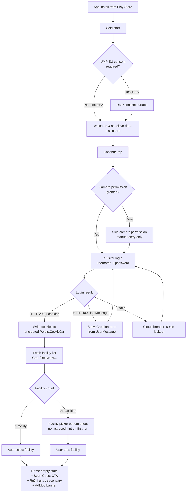
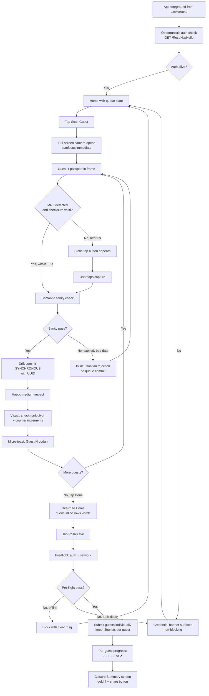
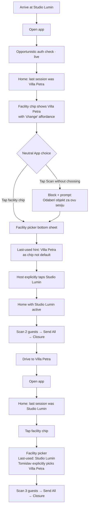

# UX Design Specification prijavko

**Author:** Darko
**Date:** 2026-04-23

---

## Executive Summary

### Project Vision

Prijavko is a single-purpose Android (Flutter) app that makes Croatian private-accommodation
host guest registration in the national eVisitor system reliable and certain at the door.
The product competes not on features but on a reliability thesis: "never loses a submission,
never fails silently." Every UX decision traces to this promise.

eVisitor's current UX gap is a silent-failure problem, not a speed problem. The real job
is making the host feel certain the submission actually happened — even at 21:30 on Wi-Fi
that is about to drop.

### Target Users

**Ana — Primary Persona (1–3 apartment landlord)**
- 34, owns 1–3 inherited apartments in coastal Croatia
- Registers ~40–200 guests per season
- Works phone-first, at the door, often at night or under time pressure
- Has been burned by silent session death and batch-rejection failures on competitor apps
- Values: "just works," no surprise failures, zero learning curve

**Tomislav — Secondary Persona (small portfolio operator, 3–15 units)**
- 48–60, family operator, multiple facilities per evening
- Multi-facility switching is a daily reality; wrong-facility submissions have real regulatory
  consequences (fines, disputes)
- Values: per-facility clarity, explicit confirmation, compliance paper trail

**Device context:** Phone portrait, outdoor/night lighting, potentially gloved hands,
spotty Wi-Fi, guests watching. Every interaction must work in under 3 taps while stressed.

### Key Design Challenges

1. **The door-moment constraint**: UI decisions must account for Ana at 21:30 with 4 guests
   watching. Cognitive load is maximum; stress tolerance for errors is zero. Primary flows
   must be completable with one hand, outdoors, under time pressure.

2. **Auth failure timing**: Session-dead must be discovered hours before the door, not at
   the door. The credential banner is the UX surface that carries this promise — it must be
   attention-grabbing without being panic-inducing.

3. **Per-guest isolation vs. batch progress**: The host must see that one rejected guest
   does not mean all-failed. Per-guest success/failure rendering is the core trust signal
   of the submission flow.

4. **Neutral App friction**: The explicit per-session facility choice adds one tap but
   prevents wrong-facility regulatory risk. The UX must make this feel like safety, not
   friction — the last-used hint softens it without removing the deliberate choice.

5. **3-tier capture fallback as first-class UX**: MRZ live → static-tap → manual entry
   must feel like a graceful progression, not degraded modes. Worn documents and non-EU
   IDs are real, not edge cases.

### Design Opportunities

1. **Emotional closure as product differentiator**: The post-submit Closure Summary
   ("4 guests registered at Apartman Luna at 21:47 ✓") is prijavko's emotional signature.
   No competitor has this. It is the shareable moment that becomes word-of-mouth.

2. **Trust through visibility**: Surfacing auth state, per-guest status, and queue count
   at a glance — without requiring the host to hunt for it — transforms invisible system
   state into felt reliability. This is omotenashi: the host should never have to wonder.

3. **Zero-PII as in-app UX story**: The 3-day auto-purge and the "Your Data" surface are
   not just compliance; they are a competitive story the UX can communicate clearly
   ("your guests' passport data is not on this phone").

## Core User Experience

### Defining Experience

The core loop is: scan passport → commit to encrypted queue → Send All → Closure Summary.
Prijavko's value is not speed — it is certainty. The host must never wonder "did it
actually send?" at 21:30 with guests watching. Every interaction in the loop is designed
to produce an unambiguous, felt confirmation of completion.

### Platform Strategy

- **Platform**: Android phone (portrait-primary, min API 24+)
- **Input**: Touch-only; single-handed operation must be possible for all primary flows
- **Lighting**: Outdoor/night and indoor low-light are first-class design contexts
- **Connectivity**: Offline-first for capture and queue; online-only for Send All
- **Permissions**: Camera only (v1.0) — minimal surface reduces Play Store friction
- **No background processing**: no foreground services, no auto-retry, no push —
  deliberate to preserve explicit-Send-All promise and reduce platform complexity

### Effortless Interactions

The following interactions must require zero conscious thought:

- **MRZ auto-shutter**: document in frame → shutter fires → haptic confirms → next guest.
  No button tap on the happy path.
- **Last-used facility hint**: visible but not pre-selected — one deliberate tap to confirm.
  Friction is load-bearing here (prevents wrong-facility regulatory risk).
- **Send All**: single tap from home; no confirmation dialog; pre-flight check is
  transparent. The host's mental model: tap → watch per-guest progress → done.
- **Auth recovery**: credential banner → one tap → session restored → same context
  preserved. No navigation, no re-entry of credentials.
- **Closure Summary auto-render**: appears immediately after last guest resolves.
  Host's only action: optionally screenshot and share.

### Critical Success Moments

| Moment | Why It's Critical | Success Signal |
|---|---|---|
| First scan (onboarding) | Establishes trust in the first 10 seconds | Auto-shutter fires within 1.5s; haptic and "Guest 1 ✓" in unsent row |
| Per-guest ✓ after Send All | Replaces the "did it actually send?" anxiety | Per-guest progress indicators settle to ✓ with no ambiguity |
| Credential banner → recovery | Proves the no-door-surprise promise | Banner visible before door moment; single tap restores session |
| Closure Summary render | Emotional closure; shareable moment | Zero-PII summary renders automatically; share button visible |
| Per-guest ✗ with edit affordance | Proves one failure ≠ all failed | Failed guest highlighted with inline edit; others remain ✓ |

### Experience Principles

1. **Certainty over speed**: Every action produces an unambiguous, felt confirmation.
   Silent transitions are failures. If the host can't see the state, the state doesn't exist.

2. **Explicit over implicit**: Facility choice, Send All trigger, auth state, queue count —
   all surfaced. The app never assumes on behalf of the host.

3. **Graceful degradation is first-class**: MRZ live → static-tap → manual entry are equal
   paths, not tiers. The UX treats worn documents and non-EU IDs as normal, not edge cases.

4. **Panic-proof design**: All primary flows completable in under 3 taps, one-handed,
   outdoors at night. Error states provide one clear next action, not a menu of choices.

5. **Zero-anxiety data handling**: The host never wonders what's on the phone.
   Queue count and 3-day auto-purge status are surfaced proactively in "Your Data."

## Desired Emotional Response

### Primary Emotional Goals

**North-star emotion: Certainty → Relief.**

The host's current emotional burden with competitor apps is anxiety: "did it actually send?"
at 21:30 with guests in the corridor. Prijavko's primary emotional job is to replace that
anxiety with felt certainty — not just a technically correct submission, but an unmistakable
moment where the host *knows* it happened.

The Closure Summary is where this certainty lands. Every other design decision in the app
is preparation for that moment.

### Emotional Journey Mapping

| Stage | Target Emotion | Design mechanism |
|---|---|---|
| First install | Cautious curiosity → reassurance | Play Store copy: reliability thesis, not feature list |
| Onboarding & data policy | Clarity → comfort | Plain Croatian: "your guests' passport data is not on this phone after 3 days" |
| First scan (auto-shutter) | Surprise → instant trust | Auto-shutter fires in <1.5s; haptic + "Guest 1 ✓" appears immediately |
| Send All → per-guest ✓ | Tension → release → relief | Per-guest progress indicators; one failure does not affect others |
| Closure Summary | Accomplishment + shareability | Zero-PII summary with share button; designed to be screenshotted |
| Error recovery (session-dead) | Calm confidence | Credential banner surfaces hours before door; single-tap recovery |
| Return visit | Trust | It worked last time; the app's job is to never give a reason to doubt |

### Micro-Emotions

**Emotions to cultivate:**
- **Confidence** during capture — every fallback (static-tap, manual entry) is clearly
  labeled as a normal path, not a failure mode
- **Trust** about data — zero-PII disclosure is upfront, not buried; auto-purge timeline
  is communicated in plain Croatian
- **Calm** during Send All — per-guest isolation removes the all-or-nothing dread; progress
  is visible and incremental
- **Accomplishment** at Closure Summary — designed as a moment worth screenshotting and
  sharing, not a transient toast notification
- **Relief** on error recovery — the credential banner's presence before the door moment
  is itself the reassurance

**Emotions to eliminate:**
- "Did it actually send?" anxiety → eliminated by per-guest ✓ and Closure Summary
- "Session expired at the door" panic → eliminated by opportunistic auth check hours earlier
- "I ruined all five registrations" shame → eliminated by per-guest isolation and
  edit-and-retry-failed-only affordance
- "What do I do next?" confusion → eliminated by single-CTA screens and
  Croatian-language error text with one clear next action

### Design Implications

| Target emotion | UX design approach |
|---|---|
| Certainty | Synchronous Drift commit before haptic fires; per-guest ✓ is the primary success signal; Closure Summary is a full-screen moment, not a toast |
| Relief before the door | Credential banner is non-blocking but impossible to ignore; surfaces auth state hours before the host reaches a guest |
| Trust through transparency | "Your Data" surface shows exactly what's on device; 3-day auto-purge countdown is visible; one-tap "delete everything" available |
| Calm under pressure | Single prominent CTA per screen; no modals or confirmation dialogs in primary flows; error states show one action, not a menu |
| Accomplishment at closure | Closure Summary includes facility name, count, and local timestamp — specific enough to feel real; share sheet accessible from the screen itself |

### Emotional Design Principles

1. **Make the invisible visible**: Auth state, queue count, submission outcome — all surfaced
   proactively. The host should never have to wonder about system state.

2. **Earn trust before the door**: The product's emotional promise is delivered hours before
   the stressful moment, not during it.

3. **Failure states produce calm, not panic**: Every error surface has one clear next action
   in Croatian. The emotion target for every error state is "I know what to do" not "I'm stuck."

4. **The Closure Summary is a product moment**: It is not a confirmation dialog. It is the
   emotional payoff of the entire experience — designed to be felt, remembered, and shared.

5. **Competence through simplicity**: The app should make the host feel competent,
   not dependent. Minimal steps, clear feedback, no jargon.

## UX Pattern Analysis & Inspiration

### Inspiring Products Analysis

**Primary inspiration sources chosen with rationale:**

**George (Erste Bank Croatia)** — trust-first utility design
Relevant patterns: zero-clutter home with one primary action; per-transaction status rows
with clear icon + state + timestamp; bottom sheets for contextual actions; first-class
Croatian localization. Directly transferable to prijavko's per-guest submission status
rendering and facility picker.

**Airbnb host app** — premium utility for non-technical operators
Relevant patterns: card-based queue content with generous padding; big, confident CTAs;
status chips over floating badges; warm illustration on empty/success states. Sets the
aesthetic bar for prijavko's queue rows and closure moments.

**WhatsApp** — status-indicator master class
Relevant patterns: delivery checkmarks (○ → ↑ → ✓ → ✗) as the clearest per-item progress
language in consumer software; minimal chrome; offline-first queue with retry semantics.
The delivery-tick language is the direct analog for prijavko's per-guest submission status —
the single highest-leverage pattern lift.

**Gmail** — batch-action and undo pattern
Relevant patterns: undo snackbars for destructive actions; swipe-to-action on list items;
FAB for primary action. Loose analog for prijavko's 3-day soft-undo visualization and
queue row actions.

**Premium Flutter / banking UI kits (Etsy signup kit, UI8 banking design)** — aesthetic target
Relevant visual cues: generous whitespace; large confident typography; soft shadows and
subtle depth; custom or stroke-based iconography; sparing use of brand accent; dark-mode
native design. The aesthetic target is "trusted utility with premium finish" — not fintech-flashy.

### Transferable UX Patterns

**Navigation:**
- Zero-bottom-tab-bar home — single-job app doesn't need tabs
- Bottom sheet for facility picker (rises from bottom, doesn't replace the screen)
- Settings accessible via gear icon, not cluttering primary flow

**Interaction:**
- **WhatsApp-style per-item status glyphs** → per-guest submission status: ○ queued,
  ↑ sending, ✓ accepted, ✗ failed. Four states. No more.
- **George-style inline transaction status** → failed guest row shows reason + [edit] action
  inline, not in a modal
- **Gmail-style undo snackbar** → in-session delete from queue; 3-day soft-undo on submitted
  rows uses "X days remaining" chip instead
- **Airbnb-style swipe actions** → optional in v1.0; tap-to-expand queue row is the safe default

**Visual:**
- Generous spacing and 56dp+ button heights for one-handed use at night
- Single-accent palette: primary (trust-signaling deep color), semantic success green,
  semantic error red, neutral grayscale everywhere else
- Dark mode native — first-class design, not a retrofit
- Illustration only at emotional moments (Closure Summary, empty states) — never in scan flow

**Trust:**
- "Last successful submission: 15 min ago" indicator on home builds quiet confidence
- Subtle "Encrypted" or "Keystore-backed" chip on credentials screen — no jargon, no theater

### Anti-Patterns to Avoid

| Anti-pattern | Why avoid |
|---|---|
| Desktop-first form layouts (eVisitor web) | Direct competitor inversion; mobile-first is table stakes |
| Silent failure states ("something went wrong") | Violates certainty principle; the primary emotional injury prijavko exists to heal |
| Full-screen upsell modals or interstitial ads | Ads must be banner-only, outside scan/Send flow; destroys trust premise |
| Onboarding tutorials / coach marks | 90-second linear onboarding is the target; tutorials violate Just-In-Time |
| Celebration animations on destructive actions | No confetti on delete; state change is clear on its own |
| Dark patterns (forced ratings, hidden exits, fake urgency) | Zero tolerance — destroys the trust thesis |
| Nested navigation (bottom tabs → inner tabs → filters) | Every nav layer is a tax at the door moment |
| Colorful multi-color palettes | Trust signal > expression; one accent is enough |
| Skeleton screens / heavy loading states | Offline-first = most content is instant; skeletons only on live MRZ preview and Send-All progress |
| Confirmation dialogs in primary flows ("Are you sure?") | Friction that destroys the effortlessness goal; Send All is single-tap |

### Design Inspiration Strategy

**Adopt:**
- WhatsApp's delivery-tick language for per-guest status (highest-leverage pattern)
- George's clean transaction-row layout for queue and submission-result rows
- Airbnb's card pattern with generous padding for queue items
- Premium UI kit aesthetic — large type, generous spacing, soft shadows, subtle depth
- Dark-mode-native design from the first mockup
- One-accent palette discipline (plus semantic success/error)

**Adapt:**
- George's bottom-sheet pattern for facility picker — simpler than George's multi-level sheets
- Gmail's undo snackbar for in-session queue deletion — but use countdown chips, not snackbars,
  for the 3-day soft-undo on submitted rows
- Airbnb's empty-state illustration for "No unsent guests" — warm and minimal, not decorative
- Banking-app trust indicators — one or two subtle chips, not plastered "SECURE" theater

**Avoid:**
- Bottom tab navigation — not needed for a single-job app
- Tutorial overlays — linear 90-second onboarding is sufficient
- Confirmation dialogs in primary flows — Send All is single-tap
- Full-screen ads or interstitials — banner-only, outside scan/Send/credential-banner flows
- Multi-accent color palettes — one color plus semantic success/error
- Animated celebrations on submission — Closure Summary is the celebration; restraint elsewhere

The aesthetic target is **"trusted utility with premium finish"** — the quiet confidence of
George's transaction list, the readability of Airbnb's host cards, the status clarity of
WhatsApp's delivery ticks, wrapped in the spacing and typography discipline of a premium
banking UI kit.

## Design System Foundation

### Design System Choice

**Material 3 (native Flutter) with a custom theme layer. No third-party UI kit.**

This is the minimum-surface-area design system that achieves the "trusted utility with
premium finish" aesthetic target on a 5-week solo-build budget.

### Rationale for Selection

**Why Material 3 wins for prijavko:**

1. **Zero new dependencies** — built into Flutter; tracks platform conventions; production-grade
2. **Already the visual language of your target users** — George, Gmail, Google Pay all run
   Material 3; Croatian hosts have internalized this UX
3. **Accessibility and dark mode native** — `ColorScheme.fromSeed(brightness: dark)` produces
   a real dark theme; WCAG AA contrast by default
4. **Premium aesthetic achievable via theme tokens** — the inspiration kits are essentially
   Material 3 with a specific seed color, custom typography, and generous spacing; no custom
   component library required
5. **Full Flutter ecosystem compatibility** — Riverpod, Drift, Dio, flutter_secure_storage all
   coexist cleanly with zero theming friction
6. **Widget coverage is complete for prijavko's needs** — FilledButton, Card, BottomSheet,
   SnackBar, Chip, ListTile, TextField cover ~95% of the app; only ~5 custom widgets needed

**Why alternatives were rejected:**

| Option | Reason rejected |
|---|---|
| Default Material 3 (no theming) | Too generic; not the premium feel the reliability thesis demands |
| Custom design system from scratch | Not feasible in 12 effective working days solo |
| FlexColorScheme / similar packages | Unnecessary dependency; ColorScheme.fromSeed + ThemeData.copyWith does the job |
| Third-party UI kits (GetWidget, Velocity) | Lock-in, dependency bloat, quality variance; violates Monozukuri minimalism |
| shadcn-for-flutter / Forui | Not production-mature enough for passport-handling app |

### Implementation Approach

**Theming architecture:**

```
lib/
  design/
    tokens.dart         // color seed, semantic colors, spacing, radii, typography constants
    theme.dart          // buildLightTheme() / buildDarkTheme() — both from tokens
    extensions.dart     // ThemeExtension<SemanticColors> for success/warning beyond Material
  widgets/              // ~5 custom widgets (see below)
  main.dart             // MaterialApp(theme:, darkTheme:, themeMode: system)
```

**Design tokens (starting set — seed color TBD in Figma step):**

| Token | Value | Rationale |
|---|---|---|
| Primary seed | Deep trust-signaling tone (candidates: deep teal, deep indigo, deep forest green) | Not red (stress), not fintech neon, not default Material blurple |
| Semantic success | Material 3 tertiary green | Universal clear success signal |
| Semantic error | Material 3 error red | Native Material 3 semantic |
| Typography | Inter or Manrope via `google_fonts` package | Large, high-legibility, premium, variable weight, Croatian-diacritic-safe |
| Text scale | Material 3 typescale with +1 step on display/headline | Generous typography from inspiration analysis |
| Spacing grid | 4dp base (4, 8, 12, 16, 24, 32, 48) | Standard, readable at arm's length |
| Card radius | 16dp | Premium feel, matches banking-kit aesthetic |
| Button radius | 12dp | Slightly softer than default Material |
| Button min-height | 56dp | Door-moment readability, one-handed use |
| Card elevation | Material 3 tonal (no hard shadows in dark mode) | Subtle depth without skeuomorphism |
| Iconography | Material Symbols (rounded variant) | Softer, stroke-based, premium feel |

**Dark-mode-first workflow:** Every screen designed in dark mode first (night check-ins are a
real context); then validated in light. Deliberate inversion of the typical Material 3 flow.

**Custom widgets (minimal list, all built on Material 3 primitives):**

- `GuestStatusGlyph` — WhatsApp-style tick widget (○ queued, ↑ sending, ✓ accepted, ✗ failed)
- `CredentialBanner` — MaterialBanner subclass with prijavko-specific styling + one-tap action
- `FacilityPickerSheet` — showModalBottomSheet with facility list + last-used hint chip
- `QueueRow` — Card with guest status + document type + inline actions
- `ClosureSummaryScreen` — full-screen scaffold with facility + count + timestamp + share

**Not custom (use Material 3 directly):** FilledButton, OutlinedButton, TextField, Scaffold,
AppBar, SnackBar, Dialog, Chip, Switch.

**Localization:** Material 3's MaterialLocalizations for Croatian + English covers standard
prompts; custom strings via flutter_localizations + arb files.

### Customization Strategy

**Three layers, clearly separated:**

1. **Tokens** (`lib/design/tokens.dart`) — pure constants; changing a color = one file
2. **Theme** (`lib/design/theme.dart`) — ThemeData built from tokens; component defaults here
3. **Custom components** (`lib/widgets/`) — ~5 custom widgets, each documented with the "why"

**Poka-yoke at the theme level:** `ThemeExtension<SemanticColors>` makes it impossible to
reference a semantic color outside the theme — no magic hex values scattered through widgets.

**Kaizen posture:** start with Material 3 defaults everywhere; override only when a screen
demands it. Don't pre-build a premature design system.

**Figma alignment:** Figma Variables map 1:1 to tokens.dart constants; Figma Components map
to Material 3 widget names; Figma Styles map to Material 3 typescale + color scheme. This
keeps design artifacts and Flutter theme in lockstep — changes in Figma translate to one
token file in the app.

## Defining Core Experience

### The Defining Loop

**"Hold the passport up. It's queued before you lower the phone."**

Prijavko's defining experience is a one-second loop: hold passport in front of camera →
auto-shutter fires → haptic confirmation → "Guest N ✓" appears in the unsent counter.
Every other feature in the app (auth lifecycle, queue persistence, Send All, Closure
Summary) exists to make this loop feel certain. If this loop feels magical in the first
10 seconds, everything else follows.

### User Mental Model

**What hosts expect from competitors:** scan → fill form → review → submit per guest.
Mental tax: "am I done? did it send? do I need to tap Submit?"

**What hosts have already internalized from adjacent apps:**
- Apple Pay / Google Pay: hold phone → haptic → done (one second, no "submit")
- George (Erste Bank): hold card near camera → auto-detect → fields populated
- WhatsApp: send message → single check → sending in background

**Mental model carried in:** "wave the camera over it and trust the haptic." Prijavko
extends this familiar pattern to passport capture — a familiar interaction in a new
context, not novel interaction design.

**Where competitors confuse hosts:**
- eVisitor web: ambiguous submit confirmation
- mVisitor: form-first UX despite having a scanner
- Batch flows: all-or-nothing rejection with no per-item isolation

**Prijavko's mental model bet:** reliability-utility apps the user already trusts have
trained them on "auto-detect + haptic + inline status." We extend that model; we do not
ask them to learn anything new on the happy path.

### Success Criteria

| Signal | Target | How it feels to the host |
|---|---|---|
| Auto-shutter fires | <1.5s after document in frame | "It saw it immediately" |
| Haptic confirmation | <50ms after shutter | "That felt like it stuck" |
| "Guest N ✓" appears in counter | <300ms after haptic | "I can see it happened" |
| Camera ready for next guest | Immediately — no spinner | "I can just keep going" |
| No confirmation dialog | Never | "It trusts me; I don't have to trust it" |
| No form interstitial (happy path) | Never | "It captured everything I need" |

**Anti-signals (kill the experience):**
- Spinner between shutter and confirmation
- "Review before saving" screen
- "Submit this guest?" dialog
- Any state where the host wonders "did that work?"

### Novel vs. Established Patterns

**Every primitive is established:**

| Primitive | Established in | Prijavko's use |
|---|---|---|
| Live camera MRZ/doc detection | iOS document scan, banking card scan | MRZ band detection via on-device ML Kit |
| Auto-shutter on valid parse | George card scan, Google Lens | Fires on valid MRZ checksum + semantic sanity |
| Haptic as primary confirmation | Apple Pay, NFC payments | Medium-impact haptic on queue commit |
| Inline batch counter | WhatsApp queued messages, Gmail drafts | "Unsent — N" row with WhatsApp-style status glyph |
| 3-tier capture fallback | Banking apps (scan → manual) | MRZ → static-tap → manual entry |

**The combination is novel for this domain; zero user education required.**

**The deliberately novel inversion:** scan is the source of truth, forms are fallback.
Competitors treat forms as primary and scan as a convenience. Prijavko inverts this —
the host never touches a form on the happy path.

### Experience Mechanics (step-by-step)

**1. Initiation**
- Home screen with facility chosen; "Scan Guest" is the single primary CTA
- Tap → full-screen camera opens in <500ms
- Top bar: facility name (left), "X unsent" counter (right), close button
- Autofocus engages immediately; no "ready?" intermediate state

**2. Interaction**
- Host holds passport in frame
- Live MRZ detection overlay: subtle rectangle highlights detected text zone
- On valid MRZ checksum + semantic sanity: auto-shutter fires with short flash
- If no detection in 3s: static-tap button surfaces ("Tap to capture")
- If static fails or MRZ unparseable: "Enter manually" rollup offers manual entry modal

**3. Feedback (critical — 300ms window)**
- **Haptic**: `HapticFeedback.mediumImpact()` on shutter
- **Visual**: shutter flash + checkmark glyph animating into the unsent counter
- **Copy**: "Guest N ✓" micro-toast, auto-dismisses in 1.5s (not a blocking snackbar)
- **Audio**: none by default (distracting at the door)
- **Poka-yoke**: Drift synchronous commit happens *before* haptic fires — if the host
  feels the haptic, the guest is saved. This is the reliability promise in physical form.

**4. Completion**
- Camera stays open for the next scan (host lifts next passport without re-tapping)
- Bottom bar shows updated "N unsent" counter + "Done" button
- "Done" returns to home with queue visible and Send All primed

**Error states within the loop:**

| State | Host experience |
|---|---|
| MRZ detected, checksum fails | Quiet retry — no failure message; let the host reposition |
| Semantic sanity fails (expired doc, bad date) | Inline Croatian rejection with specific reason ("Isteklo 2024-11-03") |
| MRZ line truncated / worn doc | After 3s, static-tap surfaces as natural next step, not as failure |
| Manual entry | Form modal; same haptic + counter update on save |
| Camera permission denied | Manual entry becomes the primary path; no-camera flow stays fully functional |

### The 10-Second Trust Test

If a host scans their first passport and within 10 seconds feels the haptic + sees the
counter increment, they will trust the app — not through marketing copy, but through
the physical confirmation no competitor delivers. This 10-second moment is prijavko's
entire adoption funnel. Every design decision in this document flows from protecting it.

## Visual Design Foundation

### Color System

**Chosen palette: Adriatic Teal** (primary seed `#0D4F52`)

Rationale:
- Culturally resonant for Croatian coastal hosts — the color of the Adriatic at calm morning;
  registers as "home" and "calm"
- Competitively unclaimed — mVisitor (red/white), eVisitor (corporate blue), PrijaviTuriste
  (green), George (indigo). Prijavko owns teal in this market.
- Supports the "calm under pressure" emotional goal — teal is calming, not stressful
- Excellent dark-mode behavior with near-black surfaces
- Natural warm-gold pairing for the Closure Summary moment

**Alternatives considered and rejected:**
- Trust Indigo — too close to George; less differentiation in host's app drawer
- Compliance Forest — codes as environmental/sustainability; misaligned with reliability thesis

**Full color tokens:**

| Role | Token | Light | Dark | Usage |
|---|---|---|---|---|
| Primary | `primary` | `#0D4F52` | `#7FCDCF` | FilledButton, FAB, primary CTAs |
| On Primary | `onPrimary` | `#FFFFFF` | `#003738` | Text/icons on primary |
| Primary Container | `primaryContainer` | `#B4ECEE` | `#004F52` | Chips, subtle fills |
| On Primary Container | `onPrimaryContainer` | `#002021` | `#B4ECEE` | Text on primary container |
| Surface | `surface` | `#F7FBFB` | `#0E1515` | App background |
| Surface Container | `surfaceContainer` | `#E7EEEE` | `#1A2323` | Cards, sheets |
| On Surface | `onSurface` | `#0E1515` | `#E1E3E2` | Primary text |
| On Surface Variant | `onSurfaceVariant` | `#3F4948` | `#BFC9C8` | Secondary text, meta |
| Outline | `outline` | `#6F7978` | `#899392` | Dividers, borders |
| Success | `success` *(ext)* | `#2E7D32` | `#81C784` | Per-guest ✓, Closure Summary |
| Warning | `warning` *(ext)* | `#ED6C02` | `#FFB74D` | Credential banner (amber, not red) |
| Error | `error` | `#B3261E` | `#F2B8B5` | Per-guest ✗, destructive |
| Closure Accent | `closureAccent` *(ext)* | `#C9A43A` | `#D4B858` | Closure Summary only |

**Semantic rules (poka-yoke):**
- Primary teal is never used for error or destructive states
- Closure gold appears only on the Closure Summary — preserves its specialness
- Warning amber on credential banner, not error red — "attention," not "panic"
- Error red reserved for per-guest ✗ and destructive confirmations

### Typography System

**Primary typeface: Manrope** (weights 400, 500, 600, 700, 800)

Rationale:
- Variable-weight, modern, premium feel aligned with banking UI kit aesthetic
- Croatian-diacritic-safe (full Latin Extended A coverage)
- Generous x-height — excellent readability at arm's length, in low light
- Open-source (SIL OFL); bundleable to remove Google Fonts CDN dependency on first launch
- Less ubiquitous than Inter — slight distinction without novelty risk

**Fallback:** Noto Sans (ships with Android).

**Type scale (Material 3 base + 1 step on display/headline for generous typography):**

| Token | Size | Weight | Line height | Usage |
|---|---|---|---|---|
| displayLarge | 57 | 800 | 64 | Closure Summary count ("4 guests") |
| displayMedium | 45 | 700 | 52 | Onboarding headings |
| headlineLarge | 32 | 700 | 40 | Screen titles |
| headlineMedium | 28 | 700 | 36 | Section headings |
| headlineSmall | 24 | 600 | 32 | Card titles, facility name |
| titleLarge | 22 | 600 | 28 | Queue row primary text |
| titleMedium | 16 | 600 | 24 | List headers |
| bodyLarge | 16 | 400 | 24 | Primary body, settings |
| bodyMedium | 14 | 400 | 20 | Secondary body, descriptions |
| bodySmall | 12 | 500 | 16 | Meta, timestamps, status chips |
| labelLarge | 14 | 600 | 20 | Button text |
| labelMedium | 12 | 600 | 16 | Small labels |

**Weight discipline:**
- Headings: 700 in body content; 800 reserved for Closure Summary count
- Body: 400 only — bumping to 500 reduces premium feel
- Buttons: 600 never 700 — bold buttons feel aggressive at the door moment

### Spacing & Layout Foundation

**Base unit: 4dp.** Tokens: `space4, space8, space12, space16, space24, space32, space48, space64`.

| Token | Value | Usage |
|---|---|---|
| space4 | 4dp | Icon-to-text within status glyphs |
| space8 | 8dp | Between chips, inline stacking |
| space12 | 12dp | Form field inner padding |
| space16 | 16dp | Screen edge padding, standard gaps |
| space24 | 24dp | Card inner padding, section gaps |
| space32 | 32dp | Between major sections |
| space48 | 48dp | Hero spacing on Closure Summary |
| space64 | 64dp | Top margin on emotional moments |

**Layout principles:**

1. **Single-column, portrait-first** — no multi-column layouts; tablets get max-width (600dp) content, not a second column
2. **Generous padding over information density** — cards 24dp inner padding, list rows 16dp
3. **Thumb-reachable primary actions** — bottom third of screen reserved for CTAs;
   top third for content identity (facility, queue count)
4. **Safe-area-aware** — Android gesture insets respected for all interactive elements
5. **No floating FAB over bottom CTA** — they conflict; one or the other per screen

**Standard screen skeleton:**

```
┌─────────────────────┐
│ AppBar              │ ← 64dp (facility name, settings icon)
├─────────────────────┤
│                     │
│   Content           │ ← scrollable, 16dp horizontal padding
│   (flexible)        │
│                     │
├─────────────────────┤
│  Primary CTA        │ ← 72dp (56dp button + 16dp padding)
├─────────────────────┤
│ Gesture inset       │ ← 24dp
└─────────────────────┘
```

### Accessibility Considerations

| Rule | Requirement | Rationale |
|---|---|---|
| Touch target minimum | 48×48 dp | Android platform guideline |
| Text contrast (body) | 4.5:1 (WCAG 2.1 AA) | Readable outdoors, at night, under glare |
| Text contrast (large) | 3:1 (WCAG 2.1 AA) | ≥18sp regular / ≥14sp bold |
| Interactive contrast | 3:1 against surface | Buttons, chips, status glyphs |
| Content descriptions | Every icon-only control | TalkBack support |
| Font scaling | Up to 200% without layout breakage | System font size; verified in integration tests |
| Focus indicators | Visible in light and dark | 2dp outline, primary color |
| Haptics | Primary confirmation signal | Redundant to visual; aids low-vision users |
| Color-blindness safety | Status carries shape AND color | ○ / ↑ / ✓ / ✗ — redundant encoding |
| Localization | Croatian primary, English secondary | No English-only strings in release |

**Poka-yoke rules:**
- Status glyph always carries **both** shape and color — colorblind hosts see shape,
  low-light hosts see color, everyone benefits
- Critical destructive actions (delete all, replace OIB) require **typed confirmation** —
  not just a button tap — poka-yoke for irreversible operations

## Design Direction Decision

### Design Directions Explored

Three focused directions generated in `ux-design-directions.html` (28 total mockups),
each with 8 full-flow screens sharing the locked Adriatic Teal + Manrope + Material 3
foundation. Directions vary on layout density, primary-action posture, and queue visibility:

- **Direction A — Calm & Spacious**: single bottom-anchored CTA; empty-state friendly;
  minimal chrome. George-like restraint. Lowest cognitive load.
- **Direction B — Dense Utility**: inline queue rows on home; dual CTAs (Send All + Scan);
  Airbnb-host-dashboard density. Best context for multi-facility users.
- **Direction C — Camera-Forward**: live camera preview on home; scan is always one tap.
  Deepest commitment to the defining experience. Deferred to v1.1 due to battery cost,
  camera-permission gate, and Play Store review friction.

**Plus a shared session-recovery section** across all directions: credential banner,
one-tap reauth, circuit-breaker lockout, closure summary.

### Chosen Direction

**Direction A baseline + Direction B's inline-queue-when-non-empty pattern + Direction B's
manual-entry secondary CTA.**

Specifically:
- Home defaults to A's empty-state layout when queue is empty (single "Scan Guest" CTA +
  "Ručni unos" secondary)
- When queue has 1+ guests, home surfaces B's inline row list with dual CTAs (Send All
  primary, Scan + Manual Entry secondary)
- Manual entry is a first-class path (not a hidden fallback) — real use case for non-EU IDs,
  worn documents, and denied camera permissions
- All other screens follow Direction A's spacing and typography

### Login & Authentication Flow

**Credentials captured:** username + password only.

**API key handling:** the eVisitor `apikey` is embedded in the app at build time (single
shared vendor key across all hosts). This simplifies onboarding, reduces time-to-first-scan,
and eliminates one of the most common first-run abandonment points (users hunting for the
API key in eVisitor settings).

**Known residual risk:** an embedded API key can be extracted via APK reverse engineering
(apktool / dex2jar). Mitigations:
- Key rotation path exists via Play Store update (~3-day delay for staged rollout)
- The API key is likely a coarse-grained vendor key (not per-user), making individual
  leakage low-impact
- **Week-1 spike blocker**: confirm with HTZ whether the API key is truly app-vendor-scoped
  or per-account. If per-account, the embedded-key approach is invalid and the apikey field
  returns to the login UI.

**Login screen:** username + password fields only; "🔒 Podaci se čuvaju šifrirano u
Android Keystore-u" reassurance line; single "Prijavi se" button.

**Pre-login flow (first launch):**
1. UMP/CMP EU consent (ad personalization — pre-onboarding, before Welcome screen)
2. Welcome + consent (sensitive-data disclosure, 3-day retention, ToS/Privacy links)
3. eVisitor login (username + password)
4. Facility picker (bottom sheet — auto-selected if single facility)
5. Home

**Post-login session handling:**
- Cookies persisted ~14 days sliding via PersistCookieJar (AES-GCM encrypted at rest)
- Opportunistic auth check on app foregrounding (non-blocking)
- Session dead → non-blocking credential banner on home + blocked Send All until reauth
- One-tap reauth from banner: username pre-filled from Keystore; password only
- 3 consecutive login failures → client-side circuit breaker opens for 6 minutes
  (stricter than Rhetos's 5-fail / 5-min server lockout)

### Ad Placement (v1.0)

**Single AdMob anchored-adaptive banner (50–100dp) on Home only.**

| Surface | Ads? | Why |
|---|---|---|
| Home (empty or with-queue) | ✅ Banner between queue content and CTA section | Non-critical surface; bounded dwell time; host sees it when idle, not under pressure |
| UMP consent | ❌ | Consent surface itself |
| Welcome / onboarding | ❌ | First impression; trust premise |
| eVisitor login | ❌ | Credential screen; no ads near sensitive inputs |
| Facility picker | ❌ | Choice screen; ads add pressure |
| Scan (camera) | ❌ | Door moment; fully blocked per PRD |
| Send All progress / results | ❌ | Reliability moment; fully blocked per PRD |
| Credential banner / reauth | ❌ | Error-recovery state; ads would feel hostile |
| Closure Summary | ❌ (sacred) | Emotional payoff; the shareable moment |
| "Your Data" / Settings | ❌ | Low impression value + trust-sensitive |
| Per-guest retry / edit | ❌ | Error-recovery flow |

**No interstitials in v1.0** — deliberate deviation from the PRD's permission to use
interstitial-after-successful-Send. Rationale: any interstitial near the Closure Summary
would undermine the emotional payoff and the trust thesis. Banner-only is enough to
validate willingness-to-pay for AdMob revenue (€800–€1500/yr expected).

**Pre-agreed pivot (from PRD):** if Play Store reviews flag ads as the #1 complaint,
pivot to ad-free free tier + earlier v1.1 Pro unlock. Do not compromise the trust thesis
for marginal revenue.

**Banner specifics:**
- Slot: between queue content and primary CTA, on Home only
- Size: AdMob anchored adaptive banner (device-responsive, 50–100dp)
- Minimum 16dp gap from queue rows (no content-click overlap)
- Collapsible banner variant if AdMob supports it (reduces "ads in face" complaints)
- Never present while credential banner is active (warning > ads)
- UMP-gated for non-consenting EEA users (non-personalized ads only)

### Design Rationale

**Why A is the visual baseline:**
- Lowest cognitive load at the door moment — one thing to do per screen
- Best aesthetic fit for "trusted utility with premium finish"
- Lowest build cost against 5-week solo timeline
- Lowest Play Store sensitive-data review friction (no always-on camera)
- Works with or without camera permission (manual entry remains fully functional)

**Why adopt B's inline-queue pattern when queue is non-empty:**
- The queue is the reliability story — when there are unsent guests, the host needs to
  see them immediately, not hunt for them
- Two-mode home (empty vs. active) is a single UX seam, not a competing design language
- Tomislav (multi-facility secondary persona) benefits without degrading Ana's flow

**Why manual entry is a first-class secondary CTA:**
- Non-EU ID cards and worn documents are known MRZ-accuracy risks (PRD § 3)
- Camera permission can be denied (FR4); manual path must be fully functional
- Hiding manual entry behind a fallback state would violate the "graceful degradation
  is first-class" experience principle

**Why Direction C is deferred to v1.1:**
- Battery-always-on-camera risk undermines the reliability thesis (dead battery = dead app)
- Hard camera-permission gate breaks the no-camera-required guarantee (FR4)
- Play Store sensitive-data review more likely to flag always-on camera
- Medium build complexity (CameraX-on-home lifecycle) wrong for v1.0 solo timeline
- Revisit post-launch only if real user demand surfaces in reviews

### Implementation Approach

- All mockups in `ux-design-directions.html` render the Adriatic Teal + Manrope +
  Material 3 tokens from Step 8 — these are the tokens that ship to Figma and to Flutter
- Figma design work in subsequent steps starts from the chosen baseline (A + B inline
  queue + B manual-entry CTA) and refines pixel-perfect mockups from there
- The HTML file is a decision artifact, not a long-term deliverable — once Figma mockups
  supersede it, it becomes historical context
- **Open item flagged for Week-1 eVisitor spike:** confirm API key scope (vendor-wide vs.
  per-account). Affects whether the embedded-key approach holds or the apikey field
  returns to the login UI.
- **Open item for AdMob/UMP integration:** the UMP consent surface is pre-onboarding
  (before the Welcome screen) — not yet visualized in the current mockups, needs
  sketching in subsequent steps.

## User Journey Flows

### Journey 1 — First Install & First Registration (Ana)



**Target:** install → Home ready in 90 seconds. Camera-permission-denied path stays fully
functional via manual entry. Login is username + password only (apikey embedded at build time).

### Journey 2 — Primary Happy Path: 4-Guest Door Check-in (Ana)



**Target:** door time <60s for 4 guests. Opportunistic auth check on foreground means
session drift is caught before scan ever starts. Each scan: auto-shutter → haptic →
queue commit → counter increment. Send All pre-flight blocks on offline/dead-auth.

### Journey 3 — Silent Session Death + Wi-Fi Drop (Marko)

```mermaid
flowchart TD
    A[App foreground after 9-day background] --> B[Opportunistic auth check]
    B --> C[HTTP 400 returned<br/>UserMessage: 'Niste prijavljeni']
    C --> D[Error classifier:<br/>matches /not authenticated|session/i]
    D --> E[Auth state: authenticated → reauth]
    E --> F[Credential banner on Home<br/>Sesija je istekla — Ponovi prijavu]
    F --> G[Host taps banner]
    G --> H[Reauth screen<br/>username pre-filled from Keystore<br/>password field focused]
    H --> I[POST /Login with stored creds]
    I --> J{Result}
    J -->|200 + cookies| K[Cookies written<br/>auth state: authenticated]
    J -->|400/lockout| L[Error + countdown]
    K --> M[Banner dismissed<br/>Home in normal state]
    M --> N[Scan 2 guests → queue]
    N --> O[Tap Send All]
    O --> P[Submit guest 1]
    P --> Q{Network result}
    Q -->|Wi-Fi drops: timeout| R[Classifier: network not auth]
    R --> S[Guest 1 marked pending-retry<br/>Guest 2 unchanged]
    S --> T[Banner: Poslano djelomično<br/>no auto-retry]
    T --> U[Host reconnects to Wi-Fi]
    U --> V[App NOT auto-retry<br/>explicit-Send-All principle]
    V --> W[Host taps Send All again]
    W --> X[Re-submit pending-retry guests]
    X --> Y[Per-guest ✓✓]
    Y --> Z[Closure Summary]
```

**Absorbs two independent failure modes without silent loss.** Error classifier matches
HTTP 400 + SystemMessage regex; auth state machine transitions authenticated → reauth;
credential banner surfaces non-blocking; Wi-Fi drop mid-Send produces pending-retry
state that requires explicit Send All (no auto-retry).

### Journey 4 — One Bad Passport in a Batch of Five (Ivana)

```mermaid
flowchart TD
    A[Scanning 5 guests] --> B[Guest 5: elderly grandmother<br/>hands expired ID card]
    B --> C[MRZ checksum passes]
    C --> D[Semantic sanity layer fires]
    D --> E[Inline rejection:<br/>Isteklo 2024-11-03 · tražite valjani dokument]
    E --> F[Host asks grandmother for passport]
    F --> G[New scan · valid · committed]
    G --> H[5 guests in queue]
    H --> I[Tap Pošalji sve]
    I --> J[Pre-flight pass · submit]
    J --> K[Guest 1 ✓]
    K --> L[Guest 2 ✓]
    L --> M[Guest 3: eVisitor returns 400<br/>SystemMessage: 'Missing registration number']
    M --> N[Classifier: validation not auth<br/>mark guest 3 as failed]
    N --> O[Continue with Guest 4 ✓ · Guest 5 ✓]
    O --> P[Send All results screen:<br/>4 of 5 · 1 failed]
    P --> Q[Guest 3 row highlighted red<br/>with Uredi affordance]
    Q --> R[Host taps Uredi]
    R --> S[Edit form with missing field<br/>registration number input]
    S --> T[Sanity pass · save]
    T --> U[Tap Pokušaj neuspjele 1]
    U --> V[Submit guest 3 only]
    V --> W[Guest 3 ✓]
    W --> X[Closure Summary · 5 guests]
```



**Per-guest isolation in under 45s salvage time.** Semantic sanity layer catches expired
docs pre-queue; eVisitor validation errors surface per-guest with inline edit affordance;
retry-failed-only never re-submits already-successful guests.

### Journey 5 — Multi-Facility Evening (Tomislav)



**Neutral App pattern enforced:** no automatic active-facility inheritance across sessions.
Last-used shows as a hint chip, not a default. One deliberate tap per session eliminates
wrong-facility regulatory risk. Zero wrong-facility submissions across 4 facilities ×
8–12 guests.

### Journey Patterns

**Navigation patterns:**

| Pattern | Where used | Why |
|---|---|---|
| Full-screen modal scan | Scan guest | Total focus on MRZ capture; no chrome distraction |
| Bottom sheet for choice | Facility picker, editing guest | Doesn't replace screen context; keeps user anchored |
| Top credential banner | Session-dead recovery | Non-blocking; stays visible while host continues other work |
| Home as single hub | Everywhere post-login | One place to return to; no tab navigation |
| Back via system gesture | All secondary screens | No in-app back buttons except close on full-screen |

**Decision patterns:**

| Pattern | Where | Why |
|---|---|---|
| Primary CTA + 1 secondary | Every screen with actions | No screen has more than 2 CTAs; reduces door-moment thinking |
| Neutral App explicit choice | Facility picker | Trades one tap for zero wrong-facility errors |
| No confirmation dialogs in primary flows | Send All, Scan | Effortlessness over safety-theater |
| Typed confirmation for destructive | Delete all, replace OIB | Poka-yoke for irreversible ops |

**Feedback patterns:**

| Pattern | Where | Why |
|---|---|---|
| Haptic + visual + text | Scan capture | Triple-redundant confirmation; impossible to miss |
| Inline row state transition | Per-guest submission | WhatsApp-style delivery-tick semantics |
| Non-blocking banner | Auth drift, partial failures | Informs without interrupting |
| Closure Summary full-screen | Post-submit | Emotional payoff; felt, not dismissed |
| Croatian `UserMessage` + local hint | Error states | eVisitor's message + our explanation in parallel |

**Error-recovery patterns:**

| Failure | Recovery | Time to recovery target |
|---|---|---|
| MRZ checksum fails | Silent retry (let host reposition) | <1s |
| Semantic sanity fails | Inline rejection with Croatian reason | Immediate |
| Session dead on Send All | Credential banner → 1-tap reauth | <15s |
| Network timeout mid-Send | Pending-retry marker; explicit re-Send | User-driven |
| Per-guest eVisitor rejection | Edit affordance + retry-failed-only | <1min |
| Circuit breaker lockout | 6-min countdown visible | 6min wait |

### Flow Optimization Principles

1. **Minimize taps between door arrival and queued guest** — J1: 3 taps (app open →
   Scan Guest → auto-shutter); J2: 0 friction (background-aware auth)
2. **Auth state is always visible** — no hidden "about to fail" states; either normal
   or credential-banner-on
3. **No modal dialogs in primary flows** — destructive ops use typed confirmation instead
4. **Error recovery is always one clear next action** — "what do I do?" is a product failure
5. **State persistence is unconditional** — queue survives kills, reboots, offline periods;
   `in_flight` is first-class
6. **Latency guarantees tied to user expectation** — auto-shutter <1.5s (Apple-Pay-class);
   queue commit <300ms (instant-feel); pre-flight <1s (tolerable); closure <200ms (decisive)
7. **Graceful degradation never feels like degradation** — manual entry is a CTA, not a
   fallback; camera-denied is a fully functional path
8. **Multi-facility friction is a feature** — Neutral App's one-tap cost is the
   regulatory-grade safety mechanism

## Component Strategy

### Design System Components (Material 3, no custom work)

| Widget | Usage in prijavko |
|---|---|
| `FilledButton` | Primary CTAs (Scan Guest, Send All, Prijavi se) |
| `OutlinedButton` | Secondary CTAs (Ručni unos, Skeniraj još) |
| `TextButton` | Tertiary actions (Share, Uredi) |
| `TextField` | Login, manual entry, edit guest |
| `Scaffold` + `AppBar` | Every screen |
| `SnackBar` | Undo-delete in queue |
| `Card` | Generic containers |
| `Chip` | Simple status labels, facility chip |
| `ListTile` | Settings rows |
| `Switch` | Settings toggles |
| `BottomSheet` (base) | Facility picker |
| `MaterialBanner` (base) | Credential banner |
| `AlertDialog` (base) | Typed-confirmation dialogs |
| `LinearProgressIndicator` | Send All overall progress |
| `CircularProgressIndicator` | Login spinner, pre-flight check |

**Not built — native APIs/plugins:**
- Camera: `camera` + `google_mlkit_text_recognition` (on-device MRZ)
- Haptics: `HapticFeedback.mediumImpact()` (Flutter built-in)
- Ads: `google_mobile_ads` + `google_user_messaging_platform` (UMP)

### Custom Components

Ten custom widgets, each carrying a specific UX promise that cannot be delivered by a
generic Material 3 widget. Each is built **on top of** Material 3 primitives, not
replacing them.

#### 1. `GuestStatusGlyph`

**Purpose:** Single source of truth for per-guest submission state across queue rows and
scan confirmations. WhatsApp-style delivery-tick semantics. Direct visualization of the
reliability thesis.

**Anatomy:** 24dp / 56dp / 64dp circle with inner shape glyph (○ / ↑ / ✓ / ✗).
Color encodes state; shape reinforces color (colorblind-safe).

| State | Shape | Color | Meaning |
|---|---|---|---|
| `queued` | ○ | `outline` on transparent | Saved locally, not yet sent |
| `sending` | ↑ | `onPrimaryContainer` on `primaryContainer` | In flight to eVisitor |
| `sent` | ✓ | `#003812` on `success` | eVisitor accepted |
| `failed` | ✗ | `#601410` on `error` | eVisitor rejected or network failed |
| `in_flight_unresolved` | ⋯ | `onSurfaceVariant` on `surfaceContainer` | Awaiting reconciliation after crash |

**Variants:** `size: small (24dp) | large (56dp) | hero (64dp)`.

**Accessibility:** Croatian semantics label per state; shape is redundant to color
(colorblind-safe); non-interactive by itself.

**Poka-yoke:** sealed-enum state; widget cannot render invalid state; no hex colors.

#### 2. `QueueRow`

**Purpose:** Canonical list row for queued/in-flight/submitted/soft-undo guests.

**Anatomy:** Card with 12dp padding, 12dp radius, `surfaceContainerHigh` background.
Leading: `GuestStatusGlyph (small)`. Center: primary text (doc + masked number), meta.
Trailing: action affordance (✎ edit) or reason text.

**States:** `queued`, `sending`, `sent`, `failed` (1px error border, red name, "Uredi"
trailing), `in_flight_unresolved` (amber border, "Provjeravam…" meta).

**Variants:** `compact` (list context), `review` (Send All results — taller, more detail).

**Accessibility:** row semantics label includes state + masked identifier (no PII);
tap target ≥48dp; swipe-to-dismiss for queued-only rows with SnackBar undo.

**PII discipline:** document number always masked (e.g., "HR2184…"); name never shown.

#### 3. `QueueHero`

**Purpose:** At-a-glance queue count + system-confidence meta on Home.

**Anatomy:** `primaryContainer` fill, 14dp radius. Left: small-caps label + big count
(`displayMedium`, weight 800). Right: meta (2 lines, `onPrimaryContainer` 85%).

**States:**
- `empty, recent_success` — "Zadnja prijava: prije N min"
- `empty, no_recent` — "Skeniraj za prvog gosta"
- `non_empty` — "Dodirni Pošalji sve"
- `auth_dead` — "Slanje blokirano" (only when credential banner is on)

**Accessibility:** compound semantics merged to single TalkBack utterance; auto-scales
with system font.

#### 4. `CredentialBanner`

**Purpose:** Non-blocking session-state notifier. The UX surface that delivers the
no-door-surprise promise.

**Anatomy:** `MaterialBanner` subclass; `warning` amber background (never red);
leading ⚠; Croatian message; single-tap trailing action.

**States:**
- `session_expired` — "Sesija na eVisitoru je istekla. — Ponovi prijavu"
- `credentials_missing` — "Podaci za prijavu nedostaju. — Unesi ponovno"
- `network_unreachable` — "Nema interneta. Pokušaj kad se povežeš."
- `partial_send_pending` — "Poslano N od M. Dodirni Pošalji sve za ostatak."

**Variants:** `warning` (default) / `info` (primary-container tone); never red.

**Accessibility:** announced on appearance (live region); action is a 48dp button;
dismissible on reauth success.

**Poka-yoke:** never appears simultaneously with AdBanner (warning > ads).

#### 5. `FacilityPickerSheet`

**Purpose:** Facility choice surface preserving Home context. Neutral App pattern.

**Anatomy:** `showModalBottomSheet` with 20dp top radius; handle indicator; H4 title;
row cards. Last-used row has 1.5px primary border + "Zadnji" pill (never auto-selected).

**States:** `loaded 1 facility` (auto-selected, sheet skipped), `loaded 2+`, `loading`
(skeleton rows), `error` (retry), `empty`.

**Accessibility:** sheet = dialog role; modal focus; handle labeled; rows ≥48dp.

**Poka-yoke:** tap outside sheet is cancel, not a choice — requires explicit row tap.

#### 6. `MRZViewfinder`

**Purpose:** Scan overlay with reticle, corner anchors, hint, top chrome.

**Anatomy:** full-screen stack over camera preview. Center 200×130 rounded rectangle
with primary-color corner accents; dark overlay outside; top-left close; top-right
`ScanCounterChip`; bottom hint.

**States:** `scanning`, `mrz_detected_validating` (pulse, <300ms), `static_tap_available`
(tap button), `capture_confirmed` (full-screen success overlay handoff).

**Accessibility:** close labeled; counter labeled; camera preview itself is visual-only.

**Note:** auto-shutter logic is controller concern; this widget is the visual contract.

#### 7. `CaptureConfirmation`

**Purpose:** 1.5s post-scan visual delivering "it stuck." Pairs with haptic fired before
render.

**Anatomy:** full-bleed `surface`; 72×72 `success` circle with checkmark; title
"Gost N dodan"; subtitle "Skeniram sljedećeg…".

**States:** `shown` (200ms fade-in / 400ms hold / 200ms fade-out → back to `scanning`),
`dismissed_early` (tap close → back to Home).

**Accessibility:** announced as live region; visible in high-contrast mode.

**Poka-yoke:** haptic fires BEFORE render; if felt, Drift commit has succeeded —
visual is confirmation, not primary signal.

#### 8. `AdBanner`

**Purpose:** AdMob wrapper with UMP consent gating and platform guardrails.

**Anatomy:** 50–100dp container (anchored adaptive); optional collapse ×; below-fold on
Home only.

**States:** `loading` (no spinner), `loaded_personalized`, `loaded_non_personalized`,
`error_or_fill_fail` (collapse to 0), `disabled_auth_dead` (hidden while CredentialBanner
active), `disabled_pro_user` (v1.1 hidden permanently), `collapsed_by_user` (session
dismiss; restored on cold start).

**Variants:** `AdBannerSlot.home` — only valid placement in v1.0.

**Accessibility:** collapse button labeled "Sakrij oglas"; ad content managed by AdMob.

**Poka-yoke:** build-time assertion that parent route = Home; wrong parent = compile fail.

#### 9. `ClosureSummary`

**Purpose:** The emotional payoff. Full-screen scaffold with gold count + facility +
timestamp + share. The product's signature moment.

**Anatomy:** full-screen Scaffold with linear gradient (primaryContainer → surface at 55%).
Top third: success circle (56dp) + gold count (`displayLarge`, `closureAccent`) + label +
sub. Bottom third: Share primary, Done secondary.

**States:** `all_success`, `partial_with_failures` (warning chip re: failed), `single_guest`
(singular Croatian grammar).

**Accessibility:** auto-focused on appearance; native Android ShareSheet; 200% font scaling.

**PII discipline:** NO names, NO document numbers; only facility + count + Europe/Zagreb
timestamp; share payload is text summary only (no screenshot export in v1.0 — user screens
natively).

#### 10. `TypedConfirmationDialog`

**Purpose:** Poka-yoke for irreversible destructive actions. Button tap is not enough —
user types a specific word.

**Anatomy:** `AlertDialog` with destructive action name; consequences in plain Croatian;
`TextField` expecting literal word ("ZAMIJENI" / "OBRIŠI"); destructive button enabled
ONLY on exact match; Cancel default.

**States:** `empty_input` (disabled), `partial_match` (disabled), `exact_match` (enabled,
red), `executing` (spinner; non-dismissible).

**Variants:** `replaceOib` ("ZAMIJENI") / `deleteAllData` ("OBRIŠI").

**Accessibility:** alertdialog role; input labeled with required word; action announced as
disabled until exact match.

**Poka-yoke:** case-insensitive + trim + Croatian-diacritic-aware match.

### Component Implementation Strategy

**Three-layer architecture:**

```
lib/
  design/
    tokens.dart           ← pure constants
    theme.dart            ← ThemeData from tokens
    extensions.dart       ← ThemeExtension<SemanticColors>
  widgets/
    atoms/
      guest_status_glyph.dart
    molecules/
      queue_row.dart
      queue_hero.dart
      capture_confirmation.dart
      mrz_viewfinder.dart
    organisms/
      credential_banner.dart
      facility_picker_sheet.dart
      ad_banner.dart
      typed_confirmation_dialog.dart
    screens/
      closure_summary.dart
```

**Rules:**
- Each custom widget is `const` where possible (Flutter perf)
- Each file has a top doc comment explaining *why* (Omotenashi)
- Each widget has a golden test for every named state
- Widgets use `ThemeExtension<SemanticColors>` — never hex colors
- No widget reaches outside its own file for tokens — everything via `Theme.of(context)`
- Every state enum is a sealed/Freezed union — impossible to construct invalid state

**Golden-test strategy:**
- One golden per state per widget (light + dark modes)
- Golden tests run in CI — drift blocks merge (Jidoka — stop the line)

### Implementation Roadmap

**Phase 1 (Week 1–2) — Critical-path widgets:**

| Widget | Blocks | Priority |
|---|---|---|
| `GuestStatusGlyph` | Every queue-displaying screen | Highest — builds confidence |
| `MRZViewfinder` | Scan flow (defining experience) | Highest |
| `CaptureConfirmation` | Scan flow | Highest |
| `QueueRow` | Home with-queue, Send All | High |
| `QueueHero` | Home (all states) | High |

**Phase 2 (Week 3–4) — Secondary widgets:**

| Widget | Blocks | Priority |
|---|---|---|
| `FacilityPickerSheet` | Onboarding + facility changes | High |
| `CredentialBanner` | Session-dead recovery | High |
| `ClosureSummary` | Post-submit emotional payoff | High |
| `TypedConfirmationDialog` | Settings destructive actions | Medium |

**Phase 3 (Week 4–5) — Polish + compliance:**

| Widget | Blocks | Priority |
|---|---|---|
| `AdBanner` | v1.0 monetization (after UMP is wired) | Medium |
| Theme polish | All widgets | Medium — refine after real-device testing |

**Slip protocol for Phase 3:** AdBanner can be a simple Material `Container` placeholder
during closed beta; replaced with real AdMob before 2026-05-27 public submission.

## UX Consistency Patterns

### Button Hierarchy

| Level | Material 3 widget | When | Max per screen |
|---|---|---|---|
| Primary | FilledButton (56dp, primary color, 12dp radius) | Most important action | 1 |
| Secondary | OutlinedButton (48dp, 1.5px outline) | Supporting action | 1 |
| Tertiary | TextButton | Low-priority navigation | 1–2 |
| Destructive | FilledButton (error color) + TypedConfirmationDialog gate | Delete all, replace OIB | 1 (via Settings) |

**Hard rules:**
- No screen exceeds 2 CTAs in the bottom action zone
- Primary is rightmost / bottommost in a button pair
- Button labels are verbs in Croatian sentence case
- Icons leading, 16–18dp, 6–8dp from text
- Disabled = 0.38 opacity + non-interactive

**Banned:** ghost buttons; primary+primary pairs; FAB+bottom-CTA conflict.

### Feedback Patterns

Four semantic tiers:

| Severity | Surface | Color | Example |
|---|---|---|---|
| Success | CaptureConfirmation, per-guest ✓, ClosureSummary | success green | "Gost dodan" / "Prihvaćeno" |
| Info | CredentialBanner (info), inline chip | primaryContainer | "Zadnja prijava: prije 15 min" |
| Warning | CredentialBanner (warning) | warning amber | "Sesija je istekla" |
| Error | Inline row border, per-guest ✗, form errorText | error red | "Nedostaje reg. broj" |

**Duration:**
- SnackBar: 4s
- CaptureConfirmation: 800ms (200 in / 400 hold / 200 out)
- Micro-toast: 1.5s
- CredentialBanner: persistent until state resolves
- Inline row errors: persistent until resolved
- ClosureSummary: persistent until user taps Done

**Haptic:**
- Scan capture: `HapticFeedback.mediumImpact()` — primary trust signal
- Per-guest ✓: `selectionClick` (subtle)
- Per-guest ✗: `heavyImpact` (attention)
- Destructive confirm: `heavyImpact`
- Primary CTA tap: system default
- No override on scroll/swipe

**Audio:** none by default anywhere.

### Form Patterns

**Field structure:** label above → 44dp input with 12dp padding, 1px outlineVariant border,
10dp radius → 1.5px primary on focus → 1.5px error on validation fail → errorText below.
10dp spacing between fields.

**Validation:**
- On blur for client-side (semantic sanity)
- On submit for server-side
- Never on-change (per-keystroke) — too noisy
- Croatian error text primary; English fallback only
- Invalid value stays in field — user corrects, not retypes
- Focus jumps to first invalid field on submit

**Keyboard:**

| Field | TextInputType | AutofillHints |
|---|---|---|
| Username | text | username |
| Password | visiblePassword | password |
| Document number | text with allowlist | none (PII) |
| Birth year | number | none (PII) |
| Registration number | text | none |

**Form-level:** submit button is primary, full-width, in bottom action zone. Disabled until
valid. Loading = spinner + non-dismissible. No "reset" button — back gesture is cancel.

### Navigation Patterns

**Home is the single hub.** Every flow returns to Home or to ClosureSummary (→ Home).

| Type | Widget | Back |
|---|---|---|
| Full-screen push | Navigator.push | System back/gesture |
| Full-screen modal | MaterialPageRoute(fullscreenDialog: true) | Close X top-left |
| Bottom sheet | showModalBottomSheet | Swipe down / outside = cancel |
| Alert dialog | showDialog | Cancel default |

**No bottom tab bar, no drawer, no navigation stack deeper than 2.** No deep links in v1.0.

**System integration:** system back always works; predictive back respected; hardware back
on login = exit; hardware back on scan = confirm & close.

### Modal and Overlay Patterns

**Stack priority (top to bottom):** AlertDialog > system perms > BottomSheet > CredentialBanner
> SnackBar > micro-toast.

**Only one at a time:** CredentialBanner hides AdBanner; AlertDialog freezes all else;
SnackBar replaces previous (doesn't stack).

**Dismiss behavior:**
- AlertDialog: tap outside is NOT dismiss (poka-yoke for destructive)
- BottomSheet: tap outside is cancel, not choice (Neutral App poka-yoke)
- SnackBar: auto-dismiss on duration; swipe supported
- CredentialBanner: dismisses only on state resolution

### Empty States

| Screen | Empty state | Tone |
|---|---|---|
| Home (empty queue) | "Nema neposlanih gostiju. Dodirni Skeniraj gosta." + hero count 0 | Inviting |
| Facility picker (no facilities) | "Nema objekata. Provjeri eVisitor Postavke." + link | Clear next step |
| Send All results | Never empty — Send All disabled when queue empty (poka-yoke) | N/A |
| Your Data | "Nema spremljenih podataka." + 3-day purge context | Reassuring |

No empty-state illustrations in v1.0 (Just-In-Time).

### Loading States

**Where loading appears:**

| Event | Indicator |
|---|---|
| Login submission | Button spinner + disable |
| Pre-flight (Send All) | Button spinner + block |
| Per-guest submission | Row glyph animates to `sending` ↑ |
| Facility list fetch (first time) | Bottom-sheet skeleton rows (only place skeletons are used) |
| MRZ detection | No overlay — camera feed is the indicator |

**Where loading does NOT appear:** opportunistic auth check, Drift commits, nav transitions,
Home render.

**Rule:** <200ms show nothing; 200ms–1s inline; >1s inline + cancel affordance.

### Copy and Microcopy

**Language:** Croatian primary + English fallback; sentence case; imperative CTAs; numbers
use HR locale separators (1.234); dates in HR format (3. svibnja 2026).

**Tone:** calm, not urgent; respectful, assumes competence; precise over polite.

**Croatian diacritics:** always full (č, ć, š, ž, đ); no ASCII approximation.

### Design-System Integration Rules

All custom patterns **extend** Material 3 primitives, never replace:

- CredentialBanner extends MaterialBanner
- FacilityPickerSheet uses showModalBottomSheet
- TypedConfirmationDialog extends AlertDialog
- QueueRow is a Card

**Token usage:** `Theme.of(context)` for colors (never hex); `space*` tokens for spacing
(never magic numbers); `textTheme` for typography (never ad-hoc); spacing multipliers
4/8/12/16/24/32/48/64 only.

**The non-negotiables:**
1. Status is ALWAYS shape + color, never color alone
2. Destructive actions ALWAYS require typed confirmation
3. Primary CTA placement is ALWAYS bottom action zone, full-width
4. Error states ALWAYS include Croatian reason + inline recovery affordance
5. No screen has more than ONE primary CTA
6. No primary flow uses a confirmation dialog
7. PII NEVER in status rows (masked identifiers only)
8. Closure Summary gold accent appears ONLY on Closure Summary

## Responsive Design & Accessibility

### Responsive Strategy

Platform scope: Android phone portrait primary. Tablet and landscape are non-breakage
targets, not design targets.

| Context | Width (logical) | Treatment |
|---|---|---|
| Phone portrait (primary) | 360–430dp | Full-width content; bottom CTA zone anchored |
| Phone landscape | 640–900dp | Locked out on Scan; allowed elsewhere best-effort |
| Tablet portrait/landscape | 600–1280dp+ | Content max-width 600dp, centered; no multi-column |

**Orientation locks:**
- Scan (camera): portrait only — MRZ viewfinder geometry, autofocus reliability
- Closure Summary: portrait only — designed for screenshot/share
- All other screens: free, system-respecting

**Flutter implementation:**
- `SystemChrome.setPreferredOrientations([portraitUp])` on scan + closure, restored on dispose
- `LayoutBuilder` / `ConstrainedBox(maxWidth: 600)` on every scaffold body
- `SafeArea` wraps every screen body
- `MediaQuery.textScaler` respected with clamp [0.85, 2.0]

### Breakpoint Strategy

No CSS-style breakpoints. Two structural rules:

1. Content width = `min(screenWidth, 600dp)`
2. CTA area full-width within constrained content

Split-screen multi-window: minimum supported 360dp; below that, `SingleChildScrollView`
graceful overflow rather than broken layout.

### Accessibility Strategy

**Target: WCAG 2.1 AA** (mobile-app subset). Rationale: European Accessibility Act
(EN 301 549) applies to new products in EU market from June 2025 — prijavko launches
May 2026, so EAA is de facto in scope. WCAG 2.1 AA is conservative EAA read for mobile.

**Mobile-specific WCAG 2.1 AA applied:**

| Criterion | Requirement | How met |
|---|---|---|
| 1.4.3 Contrast | 4.5:1 body / 3:1 large | Adriatic Teal palette verified |
| 1.4.4 Resize Text | Up to 200% | `MediaQuery.textScaler` respected |
| 1.4.11 Non-Text Contrast | 3:1 UI components | Outlines, chips, buttons verified |
| 2.1.1 Keyboard | Keyboard-accessible | All `InkWell` respond to focus + enter |
| 2.4.7 Focus Visible | Visible indicator | 2dp primary outline |
| 2.5.5 Target Size | 44×44 dp AA (48×48 used) | Android default exceeded |
| 3.3.1 Error Identification | Errors in text | Croatian errorText on forms |
| 3.3.3 Error Suggestion | Suggest correction | "Isteklo 2024-11-03 — tražite valjani dokument" |
| 4.1.2 Name, Role, Value | Semantics on controls | `Semantics` on custom widgets |
| 4.1.3 Status Messages | Status via role=status | `SemanticsService.announce` for banners |

**Prijavko-specific commitments (beyond WCAG):**

1. Shape + color redundancy for all status (colorblind-safe via GuestStatusGlyph)
2. Haptic as primary trust signal (low-vision-friendly scan confirmation)
3. Croatian first, English second — Croatian hosts with limited English are not second-class
4. Outdoor-light-friendly contrast (tested at high ambient luminance, not just office light)
5. One-handed operation — thumb-reachable on phones up to 6.9"

**Explicit non-goals in v1.0:**
- Voice control (may work via standard semantics; not explicitly tested)
- Switch control (low priority for door-moment use case)
- Dynamic Type >200% (Android platform limit)

### Testing Strategy

**Device matrix for manual testing:**

| Device | Purpose | Priority |
|---|---|---|
| Pixel 6 / 7 / 8 | Primary dev + golden-truth | Every build |
| Samsung A-series mid-range (2022+) | Primary user device class | Before beta + release |
| Older 6" budget (API 24–28) | Minimum-spec | Before release |
| Tablet | Non-breakage smoke | Before release |

**Automated testing:**

| Type | Tool | Covers |
|---|---|---|
| Widget | `flutter_test` | Each custom widget in isolation |
| Golden | `flutter_test` goldens | Every state × light/dark |
| Integration | `integration_test` | Flows against permanent Dio fake |
| A11y audit | `handle.semantics` | Semantic labels on interactives |
| Font-scale | Parameterized golden at 1.0/1.5/2.0 | Layout doesn't break |
| Dark mode | Parameterized golden | Every widget renders |

**Manual accessibility checks pre-release:**
- TalkBack on, navigate every primary flow end-to-end
- Display Size Large, Font Size Largest — no layout breaks
- Developer Option deuteranopia/protanopia — status glyphs still readable
- Power-save on — camera still works, haptics fire
- TalkBack OFF + focus gesture — focus ring visible

**User testing (closed beta ~2026-05-13):**
- 10 hosts across ages 30–60, varied technical skill
- Minimum 1 host with reading glasses / age-related vision decline
- Minimum 1 host in known-low-signal area
- Structured scenarios: 90s first-install, 4-guest door-moment, intentional-session-dead

### Implementation Guidelines

**Responsive:** Clamp content width to 600dp; respect font scale [0.85, 2.0]; `SafeArea`
everywhere; portrait lock on scan + closure with dispose restoration.

**Accessibility:**
- Every IconButton has `tooltip` (serves as TalkBack label + long-press hint)
- Custom widgets wrap child in `Semantics(label: 'Croatian description')`
- Banner appearance uses `SemanticsService.announce`
- Animations respect `MediaQuery.disableAnimationsOf(context)`
- Colors via `Theme.of(context).colorScheme` or `ThemeExtension<SemanticColors>` —
  never hex in widget code

**Haptic + audio discipline:**
- Scan capture haptic fires BEFORE visual (if felt, Drift commit succeeded)
- NEVER audio feedback — door-moment context makes audio distracting or embarrassing
