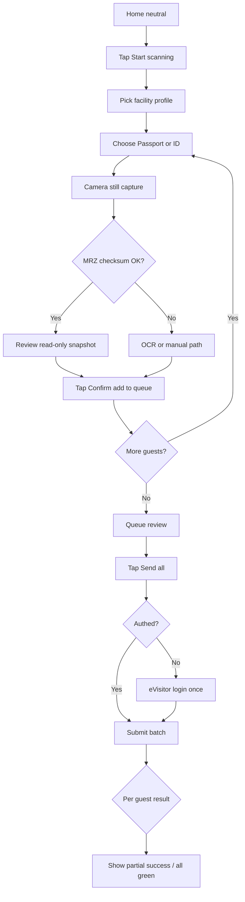
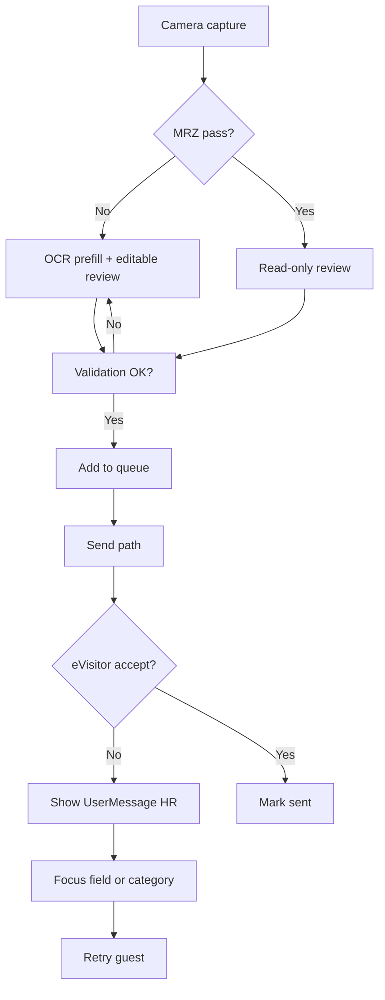
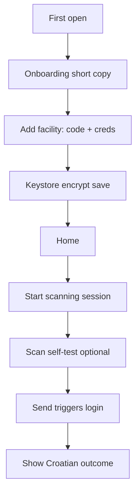
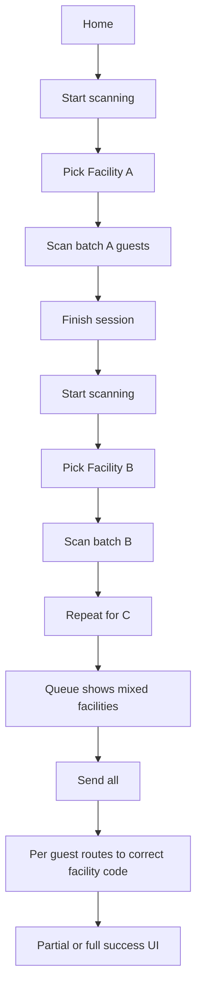

---
stepsCompleted:
  - 1
  - 2
  - 3
  - 4
  - 5
  - 6
  - 7
  - 8
  - 9
  - 10
  - 11
  - 12
  - 13
  - 14
lastStep: 14
workflowComplete: true
inputDocuments:
  - "prd.md"
  - "product-brief-prijavko.md"
---

# UX Design Specification Prijavko

**Author:** Darko
**Date:** 2026-04-14

---

<!-- UX design content will be appended sequentially through collaborative workflow steps -->

## Executive Summary

### Project Vision

Prijavko is a host-operated Android app that replaces slow, error-prone manual entry into Croatia’s eVisitor system with a **scan-first** flow: MRZ parsing with checksum validation, OCR when MRZ is missing or bad, then manual correction as a last resort. Guests accumulate in a **local, offline-first queue** and submit in **batch** when the host is ready. **Session-scoped facility selection** (neutral app → pick object when starting a session) is the core guardrail against **wrong-object** registrations—especially for hosts with **multiple facilities under one OIB**. Success is measured by **first-time submission success**: capture → eVisitor accept without field-fix cycles or repeated full retries.

### Target Users

- **Primary:** Croatian tourism hosts managing **several eVisitor objects under one OIB**, peak arrivals, high stress at the door—they need confidence they’re registering guests to the **correct** facility and a workflow that survives **interruptions** (send later, queue durable across app kill).
- **Secondary:** Single-facility hosts who still gain **speed** (foreign names, document numbers) and **deferred login**; acquisition and messaging may follow after the beachhead.
- **Builder-as-user:** The product owner uses the app in real check-ins—UX must work **one-handed, under time pressure**, with **Croatian** eVisitor errors surfaced clearly.

### Key Design Challenges

- **Door context:** Very short attention window; **scan-to-confirmed** must feel fast (MRZ path); every extra tap fights real-world pressure.
- **Facility + session model:** Make **“which object am I registering for?”** unambiguous without a dangerous persistent toggle; show facility context on **queue rows** and before **Send**.
- **Automation trust:** Distinguish **clean MRZ** (minimal friction) from **degraded paths** (OCR/manual) without eroding trust—clear tier feedback and editable review.
- **Failure surfaces:** Network down, eVisitor business rules, auth expiry—**queue never loses data**; user always knows **state** (ready / sending / failed) and **what to do next** (retry, edit field).
- **Regulatory & monetization:** **UMP/CMP** and **AdMob** must not hijack capture or submission; **FLAG_SECURE**-style sensitivity on identity and credential screens per NFRs.

### Design Opportunities

- **Differentiation through workflow:** Multi-facility safety + queue + batch send vs official web and competitors—UX can make the **session + queue** story obvious in the first minute.
- **Clarity as the moat:** Human-readable **Croatian** errors, consistent **state machine** for guests, and **history** as proof build trust for a solo-maintained app.
- **Feedback design:** Sound/haptic and inline validation (where shipped) as **confidence** signals on successful MRZ and on recoverable errors—without noisy interruptions.

## Core User Experience

### Defining Experience

The defining loop is **facility-scoped capture → validated review → queued guest → batch send to eVisitor**. The most repeated action is **scanning a document and confirming what will be submitted**; the product quality bar is **first-time submission success**—meaning the host’s **first complete attempt** results in **host-visible eVisitor acceptance** of the guest (not merely HTTP success), without avoidable field-fix cycles or repeated full capture. When the server or business rules reject a submission, the spec treats remediation as **owned by the host** with **clear Croatian messaging** and **retry/edit paths**, not silent failure.

**Success is not fully under client control** (MUP/eVisitor rules apply); UX must still make **outcomes legible** and **next steps obvious**.

### Platform Strategy

- **Android smartphone app (Flutter)** — primary surface is **one hand + camera at the door**.
- **Touch-first**; keyboard only when correcting or entering non-MRZ fields.
- **Offline-first queue**; **network required** for submission (and ad loading).
- **Device capabilities:** camera (still capture), optional torch; **ML Kit on-device**; **Android Keystore** for credentials; **no gallery import** by design.
- **Monetization / policy:** **AdMob** + **UMP/CMP** for EEA; **first-run consent** is positioned for **trust** (transparent, not “ads sneaking in”) and kept **off** the scan → confirm → queue path after initial setup.

### Effortless Interactions

- **MRZ success path:** from capture to **confirm** with minimal friction; success signaled clearly (audio/haptic when shipped).
- **Facility anchoring:** **Start scanning** + **facility pick** as a short ritual; **facility remains visible** during capture/review (e.g. header chip) so mis-attribution is rare and **wrong facility** has a defined recovery (**re-assign**, **discard**, or **end session** rules—not an ambiguous dead end).
- **Deferred authentication:** queue and capture **before** eVisitor login; login surfaces at **send** (or first send), with **single re-auth surface** when the session is invalid (**401/403**) rather than ambiguous “retry everything.”
- **Tier resolution without jargon:** MRZ → OCR → manual is **system-determined**; the host sees **submission snapshot** copy—“this is what will be sent”—and **edit** is a deliberate **correct-before-queue** action when trust is incomplete.
- **Batch send** as the default “done at the door” action; **per-guest outcomes** remain intelligible when the wire is **one request per guest** (partial batch success is normal).

### Critical Success Moments

- **“It read the MRZ” moment:** checksum pass, **submission snapshot** feels complete, fast path—sells the app in seconds.
- **Facility clarity moment:** **always-visible facility** + queue rows tagged; **Send all** is safe for multi-object hosts.
- **Wrong-facility recovery:** user can **fix object context** before send without losing trust in the queue model (rules explicit in UI).
- **Recoverable server failure:** **Croatian** message, **per-row terminal state** (success / retryable fail / hard fail), **edit + retry** without losing the guest.
- **Auth interruption:** **Paused (auth)** state—queue **not silently corrupted**; after re-auth, **clear which items** need resend vs already committed.
- **Partial batch:** mixed green/red is a **first-class** screen—not a mystery spinner.
- **Durable sending:** after process death, user sees **queued vs in-flight vs stuck** and **tap to resume**—not duplicate-send anxiety.
- **First-run trust:** facility saved, consent **feels honest**, first end-to-end attempt **completes or fails understandably**.

### Experience Principles

1. **Door-speed default** — optimize lens → **confirmed guest**; defer nonessential chrome.
2. **Facility truth first** — no ambiguous “current object”; **visible anchor** + explicit **recovery** if context was wrong.
3. **Trust-matched UI** — **submission snapshot** beats abstract “read-only”; **editable** when extraction or rules require it; capture tier is visible to set expectations.
4. **Queue as explicit contract** — **terminal states** per guest, **partial batch** honest, **auth pause** predictable; **offline** means “safe to close the app,” not “schrodinger sent.”
5. **Capture beats friction, not rules** — validation and eVisitor constraints still **block bad submits**; speed serves **correct** registration. **Non-goals** and **override** rules are explicit for engineering (no slogan-level ambiguity).
6. **Compliance chrome never hijacks capture** — UMP/ads and settings stay off the critical loop after setup; sensitive surfaces use appropriate **hardening** (e.g. FLAG_SECURE) without extra taps in the loop.

## Desired Emotional Response

### Primary Emotional Goals

- **In control at the door** — the host feels *ahead* of the arrival, not fumbling with typing or web forms.
- **Confident correctness** — especially for **multi-facility** hosts: “this guest is going to the **right** object.”
- **Calm when it breaks** — MRZ fail, OCR noise, eVisitor rejection, or dead network should feel **actionable**, not shameful; **Croatian** errors read as *fix this field*, not *you broke the system*.
- **Quiet pride** — “I handled peak check-in without opening the laptop” — word-of-mouth comes from *relief*, not flashy delight.

### Emotional Journey Mapping

| Phase | Desired feeling | UX alignment |
|--------|------------------|--------------|
| **First open / setup** | Cautious hope → **trust** (credentials, consent) | Clear **UMP** placement; facility setup feels **necessary**, not sketchy |
| **Start session** | **Grounded** — “I know which object I’m in” | **Facility anchor** always visible |
| **Capture + review** | **Flow** (MRZ) or **focused** (edit) — not rushed panic | Fast path vs explicit **submission snapshot** |
| **Queue** | **Sovereignty** — data is *mine*, *here*, *until I send* | Durable states, no phantom sends |
| **Send** | **Resolution** — batch completes or **partial** is legible | Per-row outcomes, **auth pause** without humiliation |
| **Error / retry** | **Agency** — “I can fix this” | Retry, field focus, **no blame** copy |
| **Return use** | **Familiar competence** — muscle memory, season rhythm | Neutral home, repeatable session ritual |

### Micro-Emotions

- **Confidence** over confusion — facility + queue state always readable.
- **Trust** over skepticism — automation shows **tier** (MRZ/OCR/manual) and **what will be sent**.
- **Relief** over anxiety — offline queue and **no data loss** messaging.
- **Accomplishment** over frustration — **first-time success** and **partial batch** don’t feel like personal failure.
- **Satisfaction** over empty delight — small **audio/haptic** wins on MRZ pass (where shipped), not gimmicks.

### Design Implications

- **In control** → session **facility** never implicit; **wrong-facility** recovery is **non-destructive** where possible.
- **Calm failures** → **Croatian-first** errors, **one primary action** per failure (edit / retry / re-auth), no stacked jargon.
- **Trust** → **submission snapshot** language; **terminal states** on every row; **sending** survives process death visibly.
- **Avoid** → shame language (“invalid”), **mystery spinners**, **unclear partial success**, **surprise ads** on capture/send.

### Emotional Design Principles

1. **Competence without ceremony** — speed and clarity, not celebration noise.
2. **Safety before cleverness** — emotional payoff is **correct submission**, not feature count.
3. **Failures are part of the job** — copy and UI **normalize** retry; hosts are professionals, not beta testers.
4. **Respect cognitive load** — peak season, noisy hallway, tired guests; **fewer decisions**, **clear defaults**.

## UX Pattern Analysis & Inspiration

### Inspiring Products Analysis

**WhatsApp (and similar messaging)** — Croatian hosts already use these daily. **What works:** predictable **home → thread** mental model, **low chrome**, fast actions, **locale-aware** UI without feeling “translated.” **Lesson:** the queue can feel like a **thread of guests**—scannable, newest/relevant first, **no mystery state**.

**KYC / banking-style document capture (e.g. Revolut, N26, bank apps)** — **What works:** **full-screen camera**, explicit **capture** beat, **review screen** before commitment, **errors tied to fields**. **Lesson:** align with **submission snapshot**—the user always sees **what will be sent** before it leaves the device.

**System / Google Camera patterns** — **What works:** **torch**, **clear shutter affordance**, **immediate feedback** after capture. **Lesson:** camera is a **tool**, not a marketing surface—**no extra taps** between intent and still image.

**“Official” or legacy gov/compliance UIs (incl. generic web eVisitor)** — **What often fails:** dense tables, **error codes**, **session confusion**. **Lesson:** differentiate with **Croatian human messages**, **facility anchoring**, and **offline queue**—competitive advantage is **emotional legibility**, not feature parity.

### Transferable UX Patterns

**Navigation & hierarchy**

- **Task-first home** — one obvious **Start scanning** / **Continue queue**; settings/profile **secondary** (Material **bottom nav** or single home + overflow is enough for v1 scope).
- **Session as a “mode”** — like switching accounts or workspaces: **facility** is the **mode chip**, not a buried setting.

**Interaction**

- **Capture → Review → Commit** — same **three-beat** rhythm as KYC flows; **commit** adds the guest to the **thread/queue**.
- **Batch toolbar** — select-none-needed **Send all** with **per-row status** (aggregate progress, per-item failure, as in large-list upload flows).
- **Destructive or rare actions** — **re-assign facility** / **discard** behind **clear affordances** (not long-press only).

**Visual**

- **High contrast** for outdoor door use; **large touch targets**; **status chips** (Ready / Sending / Failed / Paused auth) readable at arm’s length.

### Anti-Patterns to Avoid

- **Sticky global facility** without visible anchor — recreates wrong-object anxiety (this product explicitly rejects that pattern).
- **Interstitial or full-screen ads** on **camera open**, **review**, or **send** — violates **capture beats friction** and **calm failures**.
- **Mystery progress** during batch — **partial success** must never look like **all-or-nothing** spinners.
- **Blame-y copy** (“Invalid data”) — conflicts with **professional host** emotional goals.
- **Gallery import** — explicitly out of scope; avoids **trust** and **GDPR** pitfalls.

### Design Inspiration Strategy

**Adopt**

- **Three-beat capture flow** (camera → review → add to queue) from proven **document/KYC** patterns.
- **Thread/list clarity** from **messaging** mental models for **queue + history**.
- **Per-row terminal states** from **large-list upload** patterns.

**Adapt**

- **KYC review** → **submission snapshot** with **eVisitor-specific fields** (not generic ID proof).
- **Banking errors** → **Croatian** `UserMessage` passthrough + **field focus** where applicable.

**Avoid**

- **Web-form density** on mobile — keep **progressive disclosure** for rare fields (e.g. non-EU border fields).
- **Feature parity** with **PrijaviTuriste** / **mVisitor** checklists — win on **workflow + reliability**, not longest settings screen.

## Design System Foundation

### 1.1 Design System Choice

**Material Design 3 (Material 3)** as implemented by **Flutter’s Material layer** (`ThemeData(useMaterial3: true)`), targeting **Android-first** behavior and **Play Store** expectations. This is an **established system** approach—not a fully custom design system—extended where the product needs domain-specific surfaces (camera overlay, facility session chrome, queue state semantics).

Party-mode review **reinforced M3** for this scope; **differentiation** comes from **semantic tokens**, **typography/copy hierarchy** (Croatian), and **two branded spines**—the **facility session bar** and **camera frame**—not from replacing Material wholesale.

### Rationale for Selection

- **Platform fit:** v1 is **Android-only**; hosts already know **Material** affordances from the OS and common apps.
- **Velocity:** Solo timeline; M3 provides **accessible defaults** and **broad component coverage** so effort concentrates on **capture, queue, and eVisitor** behavior.
- **Maintenance:** One coherent system beats parallel bespoke controls unless a strong brand mandate appears (measure first).
- **Orthogonal concerns:** **AdMob**, **FLAG_SECURE**, and **CameraX** do not require a non-Material foundation; **ad placement** is a **product/layout** problem—M3 does not “fix” or “break” it.

### Implementation Approach

- **Theming:** `ColorScheme` from a **seed** (optional **dynamic color** on Android 12+ if brand allows).
- **Queue semantics in code, not ad hoc color:** use **`ThemeExtension`** (or an equivalent **token map**) for **queued / sending / failed / paused (auth) / sent**—avoid sprinkling `Theme.of(context).colorScheme` overrides per widget.
- **Single density strategy:** set **`visualDensity`** and default padding at **`ThemeData`**; document **exceptions** (e.g. compact queue rows) instead of per-screen drift.
- **Forms at scale:** one shared **`inputDecorationTheme`** and **component themes** (`FilledButtonTheme`, `SegmentedButtonTheme`, etc.) so the **review** screen with many fields does not get **per-field** style copies.
- **Optional accelerator:** **`flex_color_scheme`** (or similar) for coherent **light/dark** `ColorScheme` generation—optional, not a hard dependency.
- **Layout:** **NavigationBar** / **bottom** primary actions; **ModalBottomSheet** for contextual actions (retry, re-assign).
- **Handoff:** **Camera → review** should share **color/typography rhythm** with the scaffold so the flow does not feel like **two different apps** (Amelia: Drift/CameraX are agnostic; **theme consistency** is the glue).

### Customization Strategy

- **Semantic tokens** mapped to **`ColorScheme` roles + extensions:** distinguish **retryable** vs **terminal** failure without abusing **error** red everywhere.
- **Domain widgets:** custom **viewfinder** (frame + torch), **facility session bar** (always-visible anchor), **submission snapshot** layout—not generic dense forms.
- **Branded spine:** invest polish in **facility bar + camera chrome**; keep **standard M3** for settings/history lists to reduce maintenance.
- **Ads:** **neutral containers**; never compete with **FAB / Send**; follow **Mobile Ads** layout guidance.
- **Sensitive screens:** **FLAG_SECURE** where required; verify **contrast** still passes for **outdoor** and **night** use.

## 2. Core User Experience

### 2.1 Defining Experience

The defining interaction hosts will repeat and describe in one breath:

**“Pick the apartment, scan the passport, tap confirm—deal with eVisitor when I’m ready to send.”**

Colloquially aligned with the product pitch **Scan → Review → Send**, the **special** bit is not the camera alone—it is **session-scoped facility** + **local queue** + **batch send**, so **capture stays honest** (right object) while **submission stays decoupled** (when network and headspace allow). If this loop feels **fast, legible, and safe**, the rest of the app (settings, history, ads) is secondary.

### 2.2 User Mental Model

- **Today:** Hosts think **“I must enter this guest into eVisitor.”** The mental model is **government form**, not **camera app**—they expect **correctness under law**, **foreign names**, and **opaque errors** from the web UI.
- **They bring:** Stress at the door, **object identity** (“which flat?”), and **fear of wrong submission** (multi-object hosts).
- **Expectation we exploit:** **Still photo → structured fields** feels like **magic** when MRZ works; when it fails, they expect **to fix fields** like any form—our job is to **show tier** and **submission snapshot** so fixes are **targeted**, not panicked.
- **Confusion to prevent:** **Where is this guest going?** (facility), **Did it actually send?** (terminal state), **What do I fix?** (Croatian + field focus).

### 2.3 Success Criteria

- **“It just read it”** — MRZ path: **checksum pass**, **read-only snapshot**, **confirm** in **few taps**, with **clear success feedback** (audio/haptic when shipped).
- **Right object, no tricks** — **Facility** visible **before and after** capture; queue row shows **facility tag**; **Send** does not rely on memory.
- **Honest failure** — OCR/manual path: **editable snapshot**, **validation** before queue; server path: **Croatian message**, **retry** without shame.
- **Throughput** — **Batch send** completes with **per-row clarity** (including **partial failure** and **auth pause**).
- **Speed bar (product):** MRZ **scan-to-confirmed** stays in the **single-digit seconds** class under normal conditions (per PRD).

### 2.4 Novel UX Patterns

- **Mostly established, selectively combined:** **KYC-style** capture → review; **messaging-style** queue list; **upload-style** per-row status.
- **Novel twist for this domain:** **Neutral app + session facility** as **poka-yoke** against wrong-object submission—users must **not** rely on a **sticky “current facility”** mental model.
- **Education burden:** Low—**Start scanning** → **facility picker** teaches the ritual on **first use**; **no new gesture language** (no swipe decks, etc.).
- **Innovation inside familiarity:** **Batch across facilities** with **visible tags** is the **differentiator**, not a new interaction primitive.

### 2.5 Experience Mechanics

**1. Initiation**

- User opens app → **neutral home** (no implicit facility).
- **Start scanning** → **facility picker** (saved profiles + add) → **document type** (passport / ID) → **camera**.

**2. Interaction**

- **Capture:** still photo, **torch**, alignment frame; **ML pipeline** returns MRZ/OCR/manual tier.
- **Review:** **submission snapshot** card—**read-only** or **edit**; **validation** gates **Add to queue**.
- **Queue:** guest appears as a **row** with **name**, **facility chip**, **state**; user can **continue scanning** or **open send**.

**3. Feedback**

- **Success path:** immediate **parse feedback** (sound/haptic when shipped), **no mystery spinners** on MRZ.
- **Degraded path:** explicit **tier label** + **why edit** (checksum fail, low confidence).
- **Send path:** **progress** per guest; **partial batch** visible; **401** → **paused (auth)** with **single re-auth** surface.

**4. Completion**

- **Local completion:** guest **confirmed + queued** = host can **close the app** without losing work.
- **Remote completion:** guest **sent** (eVisitor acceptance) or **failed** with **actionable** next step; **history** records outcome for **~30 days**.
- **Next:** **next guest** (loop) or **Send all** when batch-ready.

## Visual Design Foundation

### Color System

- **Approach:** **Material 3** `ColorScheme` from a **single seed** (default direction: **teal / deep blue-green** — calm, professional, readable **outdoors**). **Optional Dynamic Color** on Android 12+ with a **fixed fallback** for marketing/screenshots.
- **Semantic mapping (M3 roles):** `primary` / `onPrimary` for **Confirm** and **Send**; `secondary`/`tertiary` for secondary actions; **surface containers** for **cards** and **queue**; **`error`** only for **blocking** validation—not for retryable queue failures.
- **Queue semantics (`ThemeExtension`):** tokens for **queued**, **sending**, **failed-retryable**, **failed-terminal**, **paused-auth**, **sent** — always **icon + label + color**.
- **Camera overlay:** **high-contrast** guides and **torch**; light corners on **dimmed preview** for **sunlight** and **hallway**.
- **Dark mode:** ship **light + dark** pairs for **night check-ins** and **FLAG_SECURE** readability.

### Typography System

- **Faces:** **Roboto** (Flutter/Android default) — full **Croatian Latin** coverage. No display gimmicks on **guest identity** surfaces.
- **Scale:** **M3 type scale**; **queue names** at **`titleMedium`/`titleSmall`** for arm’s-length scanning; **review field labels** at **`bodyLarge`** minimum.
- **Errors / eVisitor copy:** **`bodyMedium`**, comfortable **line height** for long Croatian sentences.
- **Document numbers:** prefer **tabular** or **monospace** for **digit alignment** in review (implementation detail).

### Spacing & Layout Foundation

- **Grid:** **8dp** base; **4dp** for fine icon alignment.
- **Density:** **comfortable** on **queue** and **review**; **compact** only for **history** if needed.
- **Touch:** **≥48dp** targets on **primary** actions; **stress-safe** chips and row actions.
- **Layout:** **single-column** phone-first; **horizontal inset** on wide phones for **review** forms—no multi-column forms in v1.

### Accessibility Considerations

- **Contrast:** target **WCAG 2.1 AA** on body; **status** pairs **icon + text** when contrast is tight (**glare**).
- **Dynamic type:** **review** and **errors** must **wrap** (no clipped fixed-height).
- **Color independence:** **state** never color-only.
- **Motion:** respect **Reduce motion** — success feedback falls back to **static + haptic**.
- **Copy length:** UI tolerates **longer Croatian** strings (**two-line** titles, multiline errors).

## Design Direction Decision

### Design Directions Explored

Eight static directions are implemented in **`ux-design-directions.html`** (same folder as this spec). Each shows a **mini home/queue** with **facility anchor** + **two guest rows** + **primary scan action**:

| ID | Name | Intent |
|----|------|--------|
| **A** | Teal M3 default | Stock M3 + teal seed; balanced cards; fastest path from spec to `ThemeData` |
| **B** | Outdoor high-contrast | Heavy borders, black/white + orange FAB; glare-first |
| **C** | Compact density | Tighter lists for high-volume batch; validate touch targets in build |
| **D** | Dark OLED | Night / dim hallway; re-validate semantic queue colors on `#121212` |
| **E** | Minimal chrome | Paper-like; risk of weak facility emphasis—needs strong bar in UI |
| **F** | Warm hospitality | Amber/stone warmth; less “gov SaaS” |
| **G** | Monochrome pro | Gray discipline; rely on icons for state, not only hue |
| **H** | Coral accent CTA | Indigo + coral FAB; watch conflict with **error** red |

### Chosen Direction

**Primary (recommended default): Direction A — Teal M3 default.**

Rationale: best match to **Design System Foundation** (Material 3), **Visual Design Foundation** (seed-based `ColorScheme` + semantic extensions), and **solo velocity**. B–H remain **documented alternates** for **field-test** or **seasonal** tweaks (e.g. **B** if outdoor legibility fails, **D** if night usage dominates).

### Design Rationale

- **A** maximizes **familiar Android/M3** affordances and keeps **facility chip + queue cards** visually consistent with **Google’s baseline**—lowest cognitive surprise at the door.
- **Differentiation** is carried by **session facility bar**, **queue semantics**, and **copy**, not by an exotic palette—consistent with **branded spine** vs **generic Google feel** (mitigate via tokens + Croatian hierarchy, not abandoning M3).

### Implementation Approach

- Implement **A** as **`ColorScheme.fromSeed`** with a teal-class seed (exact ARGB chosen at implementation); wire **queue** states through **`ThemeExtension`**, not ad-hoc per-widget colors.
- Add **one** design-token pass after **real-device** outdoor test: if contrast fails, borrow **B**’s **border weight** or **FAB saturation** without forking the whole theme.
- **Dark theme:** derive companion **dark** `ColorScheme` from the same seed (**Direction D** as *reference mood*, not a second app skin) so night check-in stays first-class.
- Keep **HTML showcase** path in repo for **future A/B** or **stakeholder** walkthroughs—no runtime dependency on the app.

## User Journey Flows

PRD narratives define **who / why**; this section defines **screen-level mechanics** and **recovery** aligned with **Direction A** (M3 teal) and **queue terminal states**.

### Journey 1 — Peak arrivals, MRZ happy path (single facility)

**Goal:** Capture many guests quickly, batch send when convenient.

**Notes:** Facility visible **before** `D`; queue rows carry **facility tag** even for single-object hosts (consistency).

### Journey 2 — Degraded capture + eVisitor business error

**Goal:** Never dead-end; Croatian error + field fix + retry.

### Journey 3 — First launch / facility setup

**Goal:** Trust + Keystore credentials + first successful round-trip (even if “already registered” test).

### Journey 4 — Multi-facility Saturday (Marina)

**Goal:** **Neutral app** between physical locations; **no wrong-object** send; batch across facilities.

**Notes:** **Finish session** makes “door context reset” explicit; if **Finish** is optional in MVP, **Start scanning** always returns to **facility picker** (neutral) per PRD.

### Journey Patterns

- **Entry:** **Home** is always **neutral**—no implicit facility.
- **Session:** **Facility → document type → camera**; **facility chip** persists until **session ends** or **explicit new session**.
- **Capture tier:** **MRZ / OCR / manual** label on **review**; drives **read-only vs edit**.
- **Commit:** **Confirm** is the gate to **queue**; **validation** blocks bad data before local persistence.
- **Send:** **Deferred auth**; **single re-auth** surface on **401**; **per-row** result list for **partial batch**.
- **Recovery:** **Croatian message** → **field/category fix** → **retry**; **queue** never silently drops.

### Flow Optimization Principles

1. **Shortest path to first confirmed guest** — reduce taps from **Start** to **Confirm** on MRZ path.
2. **One decision at a time** — facility, then doc type, then shutter; avoid stacked modals at the door.
3. **Honest concurrency** — **sending** is **durable**; user always sees **queued vs sending vs failed** vs **paused-auth**.
4. **No shame retries** — copy assumes **professional host**; failures are **operational**, not moral.
5. **Direction A consistency** — **primary FAB** for **Scan**; **Send** as **filled** action when queue has work—match M3 role semantics across journeys.

## Component Strategy

### Design System Components

**Material 3 (Flutter)** covers most chrome: **`Scaffold`**, **`AppBar` / `SliverAppBar`**, **`NavigationBar`**, **`NavigationDrawer`** (optional), **`FilledButton`**, **`FilledTonalButton`**, **`TextButton`**, **`OutlinedButton`**, **`FloatingActionButton`**, **`Card`**, **`ListTile`**, **`Divider`**, **`Chip` / `AssistChip` / `FilterChip`**, **`Badge`**, **`LinearProgressIndicator`**, **`CircularProgressIndicator`**, **`SnackBar`**, **`MaterialBanner`**, **`Dialog` / `AlertDialog`**, **`ModalBottomSheet`**, **`TextField`** with shared **`InputDecorationTheme`**, **`SegmentedButton`** (where a binary/ternary control fits), **`Switch`**, **`Checkbox`**, **`ListView` / `CustomScrollView`**.

Use **theme tokens** + **`ThemeExtension`** for anything **queue-specific**—do not fork **ListTile** styles per route.

### Custom Components

#### `FacilitySessionBar`

- **Purpose:** Always-visible **facility anchor** during a scan session.
- **Content:** Facility **display name**, optional **code** snippet, **session** affordance (“tap to change” / “finish session”).
- **Actions:** **Change facility** (confirm if queue non-empty), **Finish session** (optional).
- **States:** **none** (not in session), **active**, **disabled** (sending lock).
- **A11y:** **`Header`** semantics; **TalkBack** reads facility before list content.

#### `DocumentCameraView`

- **Purpose:** Full-screen **still capture** with **alignment frame** + **torch**.
- **Content:** **Camera preview** (no gallery), **document type** hint.
- **Actions:** **Shutter**, **torch**, **cancel**.
- **States:** **permission denied**, **initializing**, **ready**, **capturing**, **processing**.
- **A11y:** Large **touch targets**; **live region** for capture result (non-visual feedback).

#### `GuestSubmissionSnapshotCard`

- **Purpose:** **Review** step—shows **what will be sent** (MRZ read-only or editable).
- **Content:** Tier badge (**MRZ / OCR / manual**), identity fields, **conditional** eVisitor fields (stay, category, non-EU).
- **Actions:** **Confirm**, **Edit** (unlocks fields), **Cancel** scan.
- **States:** **readonly_ok**, **editable**, **validation_error** (inline).
- **A11y:** **Form** semantics; **error** text bound to fields.

#### `QueueGuestRow`

- **Purpose:** One **guest** in the list with **terminal state**.
- **Content:** Name, doc hint, **facility chip**, **status** (queued / sending / failed / paused-auth / sent).
- **Actions:** **Open detail**, **Retry** (failed), **Remove** (if allowed).
- **States:** Map to **`ThemeExtension`** queue tokens + **icon**.

#### `BatchSendSummary`

- **Purpose:** **Partial batch** and **auth pause** clarity.
- **Content:** Per-row **result**, aggregate **progress**, **Croatian** messages.
- **Actions:** **Retry failed**, **Re-auth**, **Dismiss** (when safe).
- **States:** **in_progress**, **paused_auth**, **completed_partial**, **completed_all**.

#### `EVisitorMessagePanel`

- **Purpose:** Display **`UserMessage`** (HR) with optional **system** detail collapsed.
- **Actions:** **Primary fix** (focus field), **Copy** (optional, careful with PII).

### Component Implementation Strategy

- **Compose custom from M3 primitives**—`FacilitySessionBar` = **`Row` + `Chip` + `TextButton`** inside **`Material`** with elevation 0–1; avoid custom **RenderObject** unless performance requires it.
- **Single source of style:** `theme.dart` provides **`InputDecorationTheme`**, **`FilledButtonTheme`**, **`NavigationBarTheme`**, **`ChipTheme`**, plus **`AppQueueTheme extends ThemeExtension`** for **queue colors** and **status icons**.
- **Camera stack** is isolated (**plugin** + overlay); **does not** import ad-hoc colors—**`ColorScheme.onSurface`** / **overlay** tokens only for guides.
- **FLAG_SECURE** screens:** still use **the same `ThemeData`** so transition from **camera → review** does not flash unrelated palettes.

### Implementation Roadmap

**Phase 1 — Ship path**

- `DocumentCameraView`, `GuestSubmissionSnapshotCard`, `FacilitySessionBar`, `QueueGuestRow`, core **M3** shell (**navigation**, **FAB**, **queue list**).

**Phase 2 — Send + failure**

- `BatchSendSummary`, `EVisitorMessagePanel`, **auth pause** + **retry** wiring, **Snackbar/Banner** patterns for transient network.

**Phase 3 — Onboarding + history + monetization**

- First-run **facility CRUD** flows (mostly M3 forms), **history list** (mostly `ListTile`), **AdMob** containers (**non-blocking**, theme-neutral surface).

**Phase 4 — Polish (nice-to-have)**

- Sound/haptic hooks, **duplicate warning** surface, **compact** history variant.

## UX Consistency Patterns

### Button Hierarchy

- **Primary:** **`FilledButton`** — **Confirm** (add to queue), **Send all** (when queue has ready items), **Retry** (failed guest when one clear action).
- **Secondary:** **`FilledTonalButton`** or **`OutlinedButton`** — **Edit** snapshot, **Change facility**, **Add facility** (non-blocking).
- **Tertiary:** **`TextButton`** — **Cancel**, **Dismiss**, **Learn more** (privacy/consent), **Skip** (only when safe).
- **FAB:** **`FloatingActionButton`** — **Scan** / **new capture** on **home** and **queue**; never **Send** on FAB (avoid catastrophic mis-tap).
- **Destructive:** **`TextButton` (error color)** or **`OutlinedButton`** — **Remove from queue**, **Discard session**—always **confirm** via **`AlertDialog`** when data loss.

### Feedback Patterns

- **Success (inline):** **SnackBar** with **short** text (“Gost dodan u red”) for **local** wins; **no** SnackBar on **every** MRZ tick if it steals focus—prefer **inline check + haptic** on capture.
- **Success (batch):** **Summary screen** or **modal** for **send results**—persistent until dismissed when **partial failure**.
- **Error (recoverable):** **`MaterialBanner`** or **inline** on **review**/**row**; include **one primary fix** action.
- **Error (auth):** **Modal** or **full-screen** **Re-auth**—**paused-auth** state on rows simultaneously.
- **Info:** **`Banner`** for **offline** (“Nema mreže — slanje će čekati”) — **non-blocking**, **dismissible** when stale.
- **Loading:** **Linear** on **send**; **Circular** only for **short** waits (&lt;2s); **never** block **camera** with full-screen spinner except **permission** flow.

### Form Patterns

- **Single column**; **group** related eVisitor fields (**Stay**, **Category**, **Non-EU** block).
- **Inline validation** on **blur** + **on submit**; **Croatian** error strings from **client rules** mirror **eVisitor** where known.
- **Progressive disclosure:** **Advanced** chevron for **rare** fields—default **host profile** supplies **payment category** etc.
- **Credentials:** **no autocomplete** on password/OIB fields (NFR); **masked** entry with **show password** optional.

### Navigation Patterns

- **Bottom navigation** (or **NavigationBar**): **Home**, **Queue**, **History**, **Settings**—**Queue** shows **Badge** with count.
- **Back:** **predictive back** friendly; **camera** and **review** on **stack**—**system back** from review returns to **camera**, not home, unless **confirmed discard**.
- **Deep actions:** **Retry**, **re-assign facility** → **`ModalBottomSheet`** with **explicit** title.

### Additional Patterns

- **Empty queue:** **Illustration-light** empty state + **Start scanning** CTA—not a dead end.
- **Empty history:** Explain **30-day** retention + **privacy** in **one** line.
- **Consent / ads:** **UMP** flow **before** first ad; **never** interstitial on **camera**/**review**/**send** per PRD.
- **FLAG_SECURE:** **Credential** + **guest PII** screens; **no** screenshots—**warn** in settings if legally needed (short).
- **Permission denied:** **Full-screen explain** + **Open settings**; **no** infinite retry loop.

## Responsive Design & Accessibility

### Responsive Strategy

- **Primary surface:** **Android phone**, **portrait-first** (PRD: phone at the door; tablets not optimized v1).
- **Extra width (large phones / unfolded):** **Increase horizontal padding** on **review** forms and **cap line length**—do **not** introduce multi-column guest forms in v1.
- **Tablet / small tablet:** Use **same** layouts with **wider margins**; optional **two-column** only for **settings** (not for **capture** or **queue**).
- **Landscape:** **Camera** and **review** should remain **usable** (rotation supported); **no** custom landscape-only desktop layouts.
- **Foldables:** **Continuity**—queue state survives **fold/unfold**; avoid **fixed** widths that clip **Croatian** strings.

### Breakpoint Strategy

- **Flutter-oriented:** use **`LayoutBuilder` / `MediaQuery`** thresholds, not web CSS pixels.
- **Suggested buckets (logical width dp):** **&lt;360** (small), **360–600** (typical phone), **600+** (large phone / small tablet)—adjust **padding** and **max content width** only.
- **No desktop breakpoints** for v1 (Android-only).

### Accessibility Strategy

- **Target:** **WCAG 2.1 Level AA** for **in-app** text and controls where applicable (Google Play + EU audience baseline).
- **Contrast:** **Body** text vs surface **≥ 4.5:1**; **large text** (≥18sp / 14sp bold) **≥ 3:1**; **UI components** and **graphics** **≥ 3:1** (M3 defaults help—verify **queue tokens** and **outdoor** glare).
- **Touch targets:** **≥ 48×48 dp** for **primary** controls; **facility chips** and **queue actions** stay **forgiving**.
- **Motion:** Respect **`MediaQuery.disableAnimations`** / platform **Reduce motion**—**success** feedback **degrades** to **static + haptic**.
- **Screen readers (TalkBack):** **Meaningful** labels for **icons** (status, retry, torch); **queue rows** expose **name + status + facility** in **traversal order**; **errors** read **full Croatian** message.
- **Keyboard:** Not primary for v1; **external keyboard** if present should **Tab** through **review** fields—no **focus traps** in **sheets** without **Esc/back** path.

### Testing Strategy

- **Devices:** At least **one mid-range** + **one low-end** Android (representative SoCs); **sunlight** outdoor pass for **camera overlay** and **queue**.
- **Accessibility:** **TalkBack** walkthrough of **home → scan → review → queue → send**; **font size** cranked to **largest** in system settings.
- **Automated:** **Flutter golden tests** for **theme** + **key screens**; **contrast** checks in CI if tooling is added later.
- **Crash/PII:** Align with NFR—**no** PII in **Crashlytics** logs.

### Implementation Guidelines

- **Layout:** Prefer **`SafeArea`**, **`Flexible`**, **scroll views** on **review**—**no** clipped **error** text.
- **Semantics:** **`Semantics`** / **`MergeSemantics`** on **queue rows**; **live regions** sparingly for **send progress**.
- **Focus:** On **error**, move **focus** to **first invalid field**; announce via **TalkBack** (`announce`).
- **FLAG_SECURE:** Still test **TalkBack** and **contrast**—security must not **break** a11y.
- **Internationalization:** **Croatian** copy **longer** than English—**avoid** fixed-width **SnackBars**; use **multiline** where needed.
